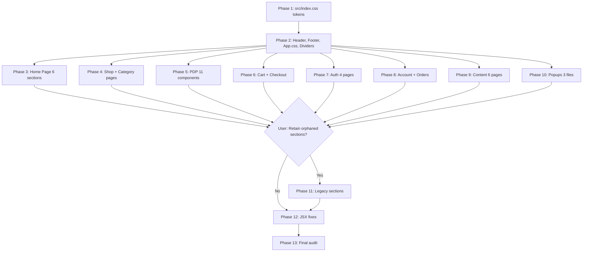

# Swadyum Design System — Full Frontend Migration Plan

## Overview

Apply the Swadyum Design System's UI specifications consistently across every page of the Vite + React storefront. **All existing page sections must be strictly preserved** — no section may be removed merely because it lacks a corresponding design in the design system folder.remove only that section which have design component present in swadyum design system ui

---

## Token Mapping: Legacy → Design System

The existing codebase uses legacy CSS variable names. These must be systematically replaced with the design system's semantic names.

| Legacy Variable | Design System Equivalent | Value |
|---|---|---|
| `--color-chili` | `--color-primary` | `#0a5a32` (green-800) |
| `--color-chili-dark` | `--color-primary-dark` | `#064022` (green-900) |
| `--color-chili-light` | `--color-primary-light` | `#15834b` (green-600) |
| `--color-mustard` | `--color-secondary` | `#c8dca0` (lime-300) |
| `--color-mustard-light` | `--color-secondary-light` | `#dcedbe` (lime-200) |
| `--color-mango` | `--color-accent` | `#e8a83a` (amber-500) |
| `--color-mango-light` | `--color-accent-light` | `#f0c46a` (amber-300) |
| `--color-clay` | `--color-primary` (duplicate) | `#0a5a32` |
| `--color-leaf` | `--color-primary` (duplicate) | `#0a5a32` |
| `--color-leaf-light` | `--color-secondary` (duplicate) | `#c8dca0` |
| `--color-ink` | `--color-ink` (keep) | `#112018` |
| `--color-cream` | `--color-bg` | `#f4f8f5` |
| `--color-muted` | `--color-muted` (keep) | `#5a6b5e` |
| `--color-card` | `--color-surface` | `#ffffff` |
| `--color-border` | `--color-border` (keep) | `#d4ddd6` |
| `--color-warm-bg` | `--color-bg-warm` | `#faf7f2` |
| `--color-bg` | `--color-bg` (keep) | `#f4f8f5` |
| `--mango-accent` | `--color-accent` | `#e8a83a` |

### Shadow Fix
- `--shadow-card-hover`: Currently uses `rgba(193, 64, 43, 0.12)` (red tint). Must change to `rgba(10, 90, 50, 0.12)` (green tint matching primary).

### Typography Fix
- All `font-family: 'Playfair Display'` → `font-family: var(--font-heading)` (Poppins)
- All `font-family: 'Brush Script MT'` → `font-family: var(--font-heading)` (Poppins italic for emotional words)
- All `font-family: var(--font-body)` used for headings → `font-family: var(--font-heading)`

### Spacing Fix
- All raw `px` values in padding/margin/gap → corresponding `var(--space-N)` tokens
- All raw `px` values in font-size → corresponding `var(--text-*)` tokens
- All raw `px` values in border-radius → corresponding `var(--radius-*)` tokens

---

## Phase-by-Phase Execution Plan

### Phase 1: `src/index.css` — Foundation Tokens & Global Styles

**File**: [`src/index.css`](src/index.css:1)

This is the single most critical file. It defines all CSS custom properties used by every other file.

**Actions:**
1. Replace all legacy variable names with design system semantic names (see mapping table above)
2. Add new design system tokens that don't exist yet: `--color-primary-dark`, `--color-primary-light`, `--color-secondary-light`, `--color-accent-light`, `--color-bg-warm`, `--color-surface`
3. Fix `--shadow-card-hover` tint from red `rgba(193, 64, 43, 0.12)` to green `rgba(10, 90, 50, 0.12)`
4. Add missing shadow tokens: `--shadow-sm`, `--shadow-md`, `--shadow-lg`, `--shadow-xl`
5. Add missing radius tokens: `--radius-xs` (2px), `--radius-sm` (4px), `--radius-md` (8px), `--radius-lg` (12px), `--radius-xl` (16px), `--radius-full` (9999px)
6. Add missing spacing tokens: `--space-0` through `--space-20` (4px base scale)
7. Add motion tokens: `--motion-fast` (150ms), `--motion-base` (250ms), `--motion-slow` (400ms), `--motion-ease`, `--motion-ease-spring`
8. Update global typography classes: `.section-eyebrow`, `.section-title`, `.section-title em`, `.section-subtitle-text` to use Poppins/Plus Jakarta Sans
9. Update global button system: `.btn-primary`, `.btn-secondary`, `.btn-text` to use new token names
10. Update `.section-padding`, `.section-container` to use spacing tokens
11. Ensure Google Fonts import includes Poppins (400, 500, 600, 700, 800) and Plus Jakarta Sans (400, 500, 600, 700)
12. Remove any Playfair Display or Brush Script MT font imports

**⚠️ CRITICAL**: This file is the foundation. All other phases depend on it being correct first.

---

### Phase 2: Global Layout Components

| File | Key Changes |
|---|---|
| [`src/Header.css`](src/Header.css:1) | Replace `--color-chili` → `--color-primary` for active/hover states, top bar background, cart badge. Replace `--color-cream` → `--color-bg`. Replace raw px with spacing tokens. |
| [`src/Footer.css`](src/Footer.css:1) | Replace `--color-chili` → `--color-primary` for social hover, submit button. Replace `--color-cream` → `--color-bg`. Replace raw px. |
| [`src/App.css`](src/App.css:1) | Replace hardcoded `#2e7d32` in toast → `--color-primary`. Replace legacy hero overlay gradient tokens. Replace raw px. |
| [`src/madhubani-dividers.css`](src/madhubani-dividers.css:1) | Replace `--color-chili` default → `--color-primary`. Ensure divider color prop uses design tokens. |

---

### Phase 3: Home Page Sections

| File | Key Changes |
|---|---|
| [`src/HeroSection.css`](src/HeroSection.css:1) | Replace Playfair Display → Poppins italic. Replace `--color-chili` → `--color-primary` for CTA buttons. Replace `--color-cream` → `--color-bg`. Replace hardcoded overlay gradients with token-based values. Replace raw px. |
| [`src/FeaturedProducts.css`](src/FeaturedProducts.css:1) | Replace `--color-chili` → `--color-primary` for active tab, sale badge, add-to-cart. Replace `--color-mustard` → `--color-secondary` for stars. Fix product names to sentence case (`.fp-name { text-transform: none }`). Replace raw px. |
| [`src/ProcessSection.css`](src/ProcessSection.css:1) | Replace `#fdf8ef` → `var(--color-bg-warm)`. Replace `#e8dcc8` → `var(--color-border)`. Replace Playfair Display → Poppins. Replace `--color-chili` → `--color-primary` for step numbers. Replace raw px. |
| [`src/ComboOfferSection.css`](src/ComboOfferSection.css:1) | Replace `--color-chili` → `--color-primary` for featured border/badge. Replace `--color-mustard` → `--color-secondary`. Replace raw px. |
| [`src/SocialProofSection.css`](src/SocialProofSection.css:1) | Replace `--color-chili` → `--color-primary` for metric numbers. Replace `--color-mango` → `--color-accent` for avatar gradient. Replace raw px. |
| [`src/FinalCTASection.css`](src/FinalCTASection.css:1) | Replace `--color-clay` → `--color-primary-dark` for dark gradient. Replace `--color-chili` → `--color-primary` for CTA button. Replace `--color-mustard-light` → `--color-secondary-light` for emphasis. Replace raw px. |

---

### Phase 4: Shop & Category Pages

| File | Key Changes |
|---|---|
| [`src/ShopPage.css`](src/ShopPage.css:1) | Replace `--color-chili` → `--color-primary` for tabs, badges, buttons. Replace `--color-mustard` → `--color-secondary` for stars. Replace Playfair Display → Poppins italic. Replace `--color-cream` → `--color-bg`. Replace hardcoded `#fafafa` → `var(--color-bg)`. Replace raw px. |
| [`src/CategoryPage.css`](src/CategoryPage.css:1) | Replace `--color-leaf` → `--color-primary` for prices, buttons. Replace `--color-mustard` → `--color-secondary` for stars, borders, pairing numbers. Replace raw px. |

---

### Phase 5: PDP Components (10 files)

| File | Key Changes |
|---|---|
| [`src/components/pdp/PdpHero.css`](src/components/pdp/PdpHero.css:1) | Replace `--color-chili` → `--color-primary` for offer strip, discount badge, active states, buttons. Replace `--color-mango` → `--color-accent` for pulse dot, stars. Replace `--color-cream` → `--color-bg`. Replace raw px. |
| [`src/components/pdp/PdpStickyBar.css`](src/components/pdp/PdpStickyBar.css:1) | Replace `--color-chili` → `--color-primary` for save badge, button borders, buy gradient. Replace raw px. |
| [`src/components/pdp/PdpTabs.css`](src/components/pdp/PdpTabs.css:1) | Replace `--color-chili` → `--color-primary` for active tab, indicator, quick-fact border. Replace `--color-card` → `--color-surface` for assurance badges. Replace raw px. |
| [`src/components/pdp/PdpTasteProfile.css`](src/components/pdp/PdpTasteProfile.css:1) | Replace `--color-chili` → `--color-primary` for flavor fill/pct. Replace `--color-mango` → `--color-accent` for glow. Replace raw px. |
| [`src/components/pdp/PdpFaq.css`](src/components/pdp/PdpFaq.css:1) | Replace `--color-chili` → `--color-primary` for open border, icon lines. Replace `--color-cream` → `--color-bg` for hover. Replace raw px. |
| [`src/components/pdp/PdpComboSection.css`](src/components/pdp/PdpComboSection.css:1) | Replace `--color-mango` → `--color-accent` for eyebrow, button, badge. Replace `--color-mustard` → `--color-secondary` for perks. Replace `--color-ink` → keep. Replace raw px. |
| [`src/components/pdp/PdpRelated.css`](src/components/pdp/PdpRelated.css:1) | Replace `--color-chili` → `--color-primary` for badge, hover border. Replace `--color-mango` → `--color-accent` for stars. Replace raw px. |
| [`src/components/pdp/PdpIngredients.css`](src/components/pdp/PdpIngredients.css:1) | Replace `--color-chili` → `--color-primary` for eyebrow. Replace `--color-warm-bg` → `--color-bg-warm`. Replace raw px. |
| [`src/components/pdp/PdpProcessTimeline.css`](src/components/pdp/PdpProcessTimeline.css:1) | Replace `--color-chili` → `--color-primary` for icon border. Replace raw px. |
| [`src/components/pdp/PdpUgc.css`](src/components/pdp/PdpUgc.css:1) | Replace `--color-cream` → `--color-bg` for placeholder. Replace `--color-muted` → keep. Replace raw px. |
| [`src/ProductDetailsPage.css`](src/ProductDetailsPage.css:1) | Replace any legacy tokens. Replace raw px. |

---

### Phase 6: Cart & Checkout

| File | Key Changes |
|---|---|
| [`src/CartPage.css`](src/CartPage.css:1) | Replace `--color-leaf` → `--color-primary` for primary actions. Replace `--color-mustard` → `--color-secondary` for hover states. Replace raw px. |
| [`src/components/cart/CartDrawer.css`](src/components/cart/CartDrawer.css:1) | Replace `--color-leaf` → `--color-primary` for progress fill, checkout button, savings badge. Replace `--color-chili` → `--color-primary` for remove hover. Replace `--color-mustard` → `--color-secondary`. Replace raw px. |
| [`src/CheckoutPage.css`](src/CheckoutPage.css:1) | Replace `--color-chili` → `--color-primary` for submit. Replace `--color-accent` → keep for use-saved button. Replace `--color-mustard` → `--color-secondary` for coupon success border. Replace raw px. |

---

### Phase 7: Auth Pages

| File | Key Changes |
|---|---|
| [`src/LoginPage.css`](src/LoginPage.css:1) | Replace `--color-leaf` → `--color-primary` for submit. Replace `--color-mustard` → `--color-secondary` for focus rings, forgot password link. Replace raw px. |
| [`src/SignupPage.css`](src/SignupPage.css:1) | Replace `--color-leaf` → `--color-primary` for submit. Replace `--color-mustard` → `--color-secondary` for focus rings. Replace raw px. |
| [`src/ForgotPasswordPage.css`](src/ForgotPasswordPage.css:1) | Replace `--color-leaf` → `--color-primary` for submit. Replace `--color-mustard` → `--color-secondary` for focus rings. Replace raw px. |
| [`src/components/auth/WhatsAppLoginModal.css`](src/components/auth/WhatsAppLoginModal.css:1) | **⚠️ SPECIAL**: Replace hardcoded WhatsApp green (`#25D366`, `#2e7d32`) → `--color-primary`. This is a brand alignment decision — WhatsApp green should yield to Swadyum green. Replace raw px. |

---

### Phase 8: Account & Order Pages

| File | Key Changes |
|---|---|
| [`src/AccountPage.css`](src/AccountPage.css:1) | Replace `--color-leaf` → `--color-primary` for avatar, active nav, save buttons. Replace `--color-mustard` → `--color-secondary` for role badge, focus rings. Replace raw px. |
| [`src/OrderDetailsPage.css`](src/OrderDetailsPage.css:1) | Replace `--color-leaf` → `--color-primary` for completed steps, primary buttons, AWB highlight. Replace `--color-mustard` → `--color-secondary` for active step. Replace raw px. |
| [`src/DeleteAccountPage.css`](src/DeleteAccountPage.css:1) | Replace `--color-chili` → `--color-primary` for headings, primary buttons. Replace raw px. |
| [`src/ThankYouPage.css`](src/ThankYouPage.css:1) | Replace hardcoded `#2e7d32` → `--color-primary` for success icon, paid status. Replace `--color-accent` → keep for track-order button. Replace raw px. |

---

### Phase 9: Content Pages

| File | Key Changes |
|---|---|
| [`src/AboutPage.css`](src/AboutPage.css:1) | Replace `--color-chili` → `--color-primary` for eyebrow, CTA card, value icons. Replace Playfair Display → Poppins. Replace `#fdf8ef` → `var(--color-bg-warm)`. Replace raw px. |
| [`src/ContactPage.css`](src/ContactPage.css:1) | Replace `--color-chili` → `--color-primary` for eyebrow, method icons, submit button, focus rings. Replace Playfair Display → Poppins. Replace raw px. |
| [`src/RecipePage.css`](src/RecipePage.css:1) | Replace `--color-chili` → `--color-primary` for badge, view-btn hover, shop-btn. Replace `--color-mango` → `--color-accent` for meta icons. Replace Playfair Display → Poppins. Replace raw px. |
| [`src/ReviewsPage.css`](src/ReviewsPage.css:1) | Replace `--color-leaf` → `--color-primary` for metric numbers, overall rating, buttons. Replace `--color-mustard` → `--color-secondary` for stars, bar fills, borders. Replace raw px. |
| [`src/ReviewSection.css`](src/ReviewSection.css:1) | Replace `--color-chili` → `--color-primary` for progress fill, write button, reviewer avatar. Replace `--color-mustard` → `--color-secondary` for stars. Replace raw px. |
| [`src/LegalPages.css`](src/LegalPages.css:1) | Replace `--color-chili` → `--color-primary` for titles. Replace `--color-accent` → keep for contact section border. Replace raw px. |

---

### Phase 10: Popups & Overlays

| File | Key Changes |
|---|---|
| [`src/ExitIntentPop.css`](src/ExitIntentPop.css:1) | Replace `--color-chili` → `--color-primary` for code box border. Replace `--color-accent` → keep for CTA button. Replace raw px. |
| [`src/DealSection.css`](src/DealSection.css:1) | Replace `--color-leaf` → `--color-primary` for subtitle, time values, badge border. Replace raw px. |
| [`src/SalesPop.css`](src/SalesPop.css:1) | Replace `--color-chili` → `--color-primary` for action text. Replace raw px. |

---

### Phase 11: Legacy Home Sections (Orphaned — User Decision Required)

These 4 sections exist as standalone JSX/CSS files but are **NOT imported** in [`src/App.jsx`](src/App.jsx:1) or any other component:

| File | Status | Key Changes If Retained |
|---|---|---|
| [`src/WhyChooseUsSection.css`](src/WhyChooseUsSection.css:1) + JSX | Orphaned | Replace `--color-leaf` → `--color-primary`. Replace `--mango-accent` → `--color-accent`. Replace Brush Script MT → Poppins. Replace `#ffffff` → `var(--color-surface)`. Replace `#f1f8f4` → `var(--color-bg)`. |
| [`src/TrustBar.css`](src/TrustBar.css:1) + JSX | Orphaned | Replace `--color-chili` → `--color-primary` for icons. Replace `--color-clay` → `--color-primary` for text. Replace `--color-cream` → `--color-bg`. |
| [`src/TeamSection.css`](src/TeamSection.css:1) + JSX | Orphaned | Replace `--color-leaf` → `--color-primary`. Replace Brush Script MT → Poppins. Replace `#ffffff` → `var(--color-surface)`. Replace `#f8f8f8` → `var(--color-bg)`. Replace `rgba(47, 94, 59, 0.3)` → `var(--color-border)`. |
| [`src/StorytellingSection.css`](src/StorytellingSection.css:1) + JSX | Orphaned | Replace `--color-mustard` → `--color-secondary`. Replace `--color-leaf` → `--color-primary`. Replace `--color-bg` → keep. Replace `#C79A3B` → `var(--color-accent)`. Replace `#2F5E3B` → `var(--color-primary)`. |

These 7 legacy home sections are also **NOT imported** in App.jsx but exist as CSS/JSX:

| File | Status | Key Changes If Retained |
|---|---|---|
| [`src/BenefitsSection.css`](src/BenefitsSection.css:1) + JSX | Orphaned | Replace `--color-mustard` → `--color-accent` for gold accents. Replace `--color-leaf` → `--color-primary` for footer statement. Replace raw px. |
| [`src/GallerySection.css`](src/GallerySection.css:1) + JSX | Orphaned | Replace `--color-leaf` → `--color-primary` for subtitle, overlay. Replace raw px. |
| [`src/ProductsSection.css`](src/ProductsSection.css:1) + JSX | Orphaned | Replace legacy tokens. Replace raw px. |
| [`src/RecipePairingSection.css`](src/RecipePairingSection.css:1) + JSX | Orphaned | Replace legacy tokens. Replace raw px. |
| [`src/Section2.css`](src/Section2.css:1) + JSX | Orphaned | Replace legacy tokens. Replace raw px. |
| [`src/SignatureExperienceSection.css`](src/SignatureExperienceSection.css:1) + JSX | Orphaned | Replace legacy tokens. Replace raw px. |
| [`src/CategoriesSection.css`](src/CategoriesSection.css:1) + JSX | Orphaned | Replace legacy tokens. Replace raw px. |

**⚠️ HALT POINT**: Before proceeding with Phase 11, ask the user whether these 11 orphaned sections should be:
- (A) Updated to design system tokens anyway (preserved for potential future use)
- (B) Left as-is since they're not actively used
- (C) Deleted entirely

---

### Phase 12: JSX Files — Inline Styles & Hardcoded Values

Several JSX files contain hardcoded colors in inline styles or SVG attributes:

| File | Hardcoded Values to Fix |
|---|---|
| [`src/BenefitsSection.jsx`](src/BenefitsSection.jsx:1) | SVG stroke/fill colors using `#C79A3B`, `#2F5E3B`, `#D87A1D`, `#A55A2A` → design tokens |
| [`src/MadhubaniDivider.jsx`](src/MadhubaniDivider.jsx:1) | Default color `var(--color-chili)` → `var(--color-primary)` |
| [`src/AboutPage.jsx`](src/AboutPage.jsx:1) | Any inline color values |
| [`src/ContactPage.jsx`](src/ContactPage.jsx:1) | Any inline color values |
| [`src/FinalCTASection.jsx`](src/FinalCTASection.jsx:1) | Inline SVG colors |
| [`src/ComboOfferSection.jsx`](src/ComboOfferSection.jsx:1) | Any inline styles |
| All JSX files with `style={{color: '#...'}}` | Replace with `var(--color-*)` references |

Also fix product name casing: wherever product names are rendered in uppercase (e.g., FeaturedProducts, ShopPage), ensure `text-transform: none` for sentence case per design system.

---

### Phase 13: Final Audit

Run the adherence lint rules from [`Swadyum Design System/_adherence.oxlintrc.json`](Swadyum%20Design%20System/_adherence.oxlintrc.json:1) against the entire codebase:

1. **No raw hex colors** — search for `#[0-9a-fA-F]{3,8}` in all CSS/JSX files
2. **No raw px values** — search for `\d+px` in all CSS files (except 1px borders, 0px)
3. **Only Poppins/Plus Jakarta Sans fonts** — search for any other font-family references
4. **All 83 allowed CSS variables present** — verify token whitelist
5. **All 18 components used with valid props** — verify component usage
6. **All sections preserved** — diff against original App.jsx page inventory

---

## Section Preservation Checklist

All sections currently rendered in [`src/App.jsx`](src/App.jsx:1) must remain intact:

- [x] Header (top bar + nav)
- [x] Footer (brand, links, newsletter)
- [x] Home: HeroSection
- [x] Home: FeaturedProducts
- [x] Home: ProcessSection
- [x] Home: ComboOfferSection
- [x] Home: SocialProofSection
- [x] Home: FinalCTASection
- [x] Home: MadhubaniDividers (between sections)
- [x] Shop page
- [x] Product Details page (PDP)
- [x] About page
- [x] Contact page
- [x] Recipes page
- [x] Reviews page
- [x] Cart page
- [x] Checkout page
- [x] Login page
- [x] Signup page
- [x] Forgot Password page
- [x] Account page
- [x] Order Details page
- [x] Category pages (dynamic)
- [x] Privacy Policy page
- [x] Delete Account page
- [x] Shipping Policy page
- [x] Return Policy page
- [x] Terms page
- [x] Thank You page
- [x] CartDrawer (overlay)
- [x] WhatsAppLoginModal (overlay)
- [x] Toast notifications
- [x] ExitIntentPop
- [x] SalesPop
- [x] DealSection

---

## Mermaid: Migration Workflow

---

## Questions for User

Before proceeding to implementation, the following decisions need user input:

1. **Orphaned legacy sections** (WhyChooseUsSection, TrustBar, TeamSection, StorytellingSection, BenefitsSection, GallerySection, ProductsSection, RecipePairingSection, Section2, SignatureExperienceSection, CategoriesSection) — these 11 sections have CSS/JSX files but are NOT imported in App.jsx. Should they be:
   - (A) Updated to design system tokens anyway (preserved for potential future use)
   - (B) Left as-is since they're not actively used
   - (C) Deleted entirely

2. **WhatsApp green** — The WhatsAppLoginModal uses hardcoded `#25D366` / `#2e7d32`. Should this be replaced with Swadyum primary green (`--color-primary`) for brand consistency, or kept as WhatsApp's brand color?

3. **Product name casing** — Currently product names render in uppercase in several places (FeaturedProducts, ShopPage). The design system specifies sentence case. Should all product names be converted to sentence case?