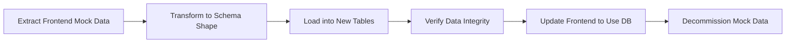
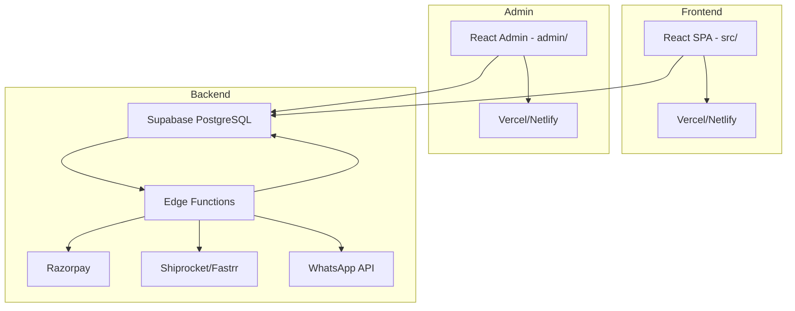
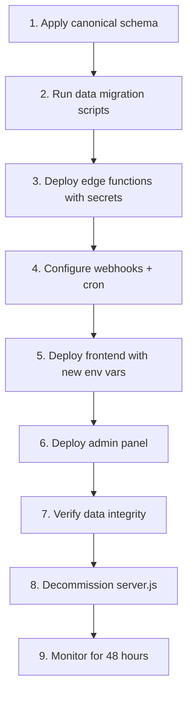

# Mango Pickle Full-Stack Architecture Plan

> **Scope:** This document audits the existing Swadyum "Mango Pickle" e-commerce codebase, identifies gaps between frontend data needs and the current backend/database/admin support, proposes a normalized PostgreSQL/Supabase schema, specifies admin panel features, documents security requirements, outlines a data migration strategy, and provides a deployment plan.
>
> **Convention:** Every claim references the actual source file and line number(s) using the format `file/path.ext:line`.

---

## Table of Contents

1. [Frontend Data Audit](#1-frontend-data-audit)
2. [Existing Backend / DB Audit](#2-existing-backend--db-audit)
3. [Gap Analysis](#3-gap-analysis)
4. [Proposed Normalized Schema](#4-proposed-normalized-schema)
5. [Admin Panel Feature Spec](#5-admin-panel-feature-spec)
6. [Security Requirements](#6-security-requirements)
7. [Data Migration Strategy](#7-data-migration-strategy)
8. [Deployment Plan Outline](#8-deployment-plan-outline)

---

## 1. Frontend Data Audit

This section catalogs every data entity, field, and shape used by the root `src/` React frontend. The frontend is a custom SPA with path-based routing via `window.history.pushState` (`src/App.jsx:39-70`, `src/App.jsx:267-321`).

### 1.1 Product Entity

**Source of truth:** `src/data/products.js` fetches from Supabase `products` table joined with `product_variants`, `product_images`, and `categories` (`src/data/products.js:12-75`).

Fields consumed by the frontend:

| Field | Source | Used In |
|-------|--------|---------|
| `id` | `products.id` | `ReviewSection.jsx:20-25` (fetch reviews by product_id) |
| `slug` | `products.slug` | `ShopPage.jsx`, `ProductDetailsPage.jsx:24-50`, `App.jsx` routing |
| `name` | `products.name` | `ShopPage.jsx`, `PdpHero.jsx:4-362` |
| `description` | `products.description` | `ShopPage.jsx`, `ProductDetailsPage.jsx` |
| `category.slug` | `categories.slug` | `ShopPage.jsx:79-101` (filter), `CategoryPage.jsx:7-22` |
| `category.name` | `categories.name` | `ShopPage.jsx`, `CategoryPage.jsx` |
| `category.banner_url` | `categories.banner_url` | `CategoryPage.jsx` |
| `variants[].weight_label` | `product_variants.weight_label` | `PdpHero.jsx:91-100`, `App.jsx:187-210` (addToCart dedupes by slug+weight) |
| `variants[].price` | `product_variants.price` | `ShopPage.jsx:110-113`, `PdpHero.jsx` |
| `variants[].mrp` | `product_variants.mrp` | `ShopPage.jsx:136-139` (getDiscount), `App.jsx:195-204` (addToCart tracks mrp) |
| `variants[].stock_quantity` | `product_variants.stock_quantity` | `ShopPage.jsx` (availability) |
| `variants[].sku` | `product_variants.sku` | `shiprocket-sync/index.ts:45-58` (fallback `SWD-{slug5}-{weight}`) |
| `images[].url` | `product_images.url` | `ShopPage.jsx`, `PdpHero.jsx` |
| `images[].alt_text` | `product_images.alt_text` | `ShopPage.jsx` |
| `images[].display_order` | `product_images.display_order` | `products.js:58-71` (sorted) |
| `pdp_config` | `products.pdp_config` (JSONB) | `ProductDetailsPage.jsx:30-33`, `PdpIngredients.jsx:5-12`, `PdpTasteProfile.jsx:3-122`, `PdpFaq.jsx:6-14` |
| `is_active` | `products.is_active` | `ProductsList.jsx:43-52` (admin toggle) |
| `created_at` | `products.created_at` | admin sorting |

**`pdp_config` JSONB sub-fields** (defined in `src/data/pdpContentMap.js:1-59` and consumed by PDP components):

- `hero_ingredients_v2` — array of `{name, image, description}` (`PdpIngredients.jsx:5-12`)
- `ingredients_table` — array of `{ingredient, percentage}` (`pdpContentMap.js:7-21`)
- `pure_ingredients` — array of strings (`pdpContentMap.js:25-31`)
- `taste_profile.metrics` — array of `{label, value, max}` (`pdpContentMap.js:34-39`, `PdpTasteProfile.jsx:7-25`)
- `taste_profile.pairings` — array of `{label, icon}` (`pdpContentMap.js:40-46`, `PdpTasteProfile.jsx:31-52`)
- `faq` — array of `{question, answer}` (`pdpContentMap.js:49-57`, `PdpFaq.jsx:6-14`)
- `tabs` — object with tab keys mapping to content (`pdpContentMap.js:5-23`)

### 1.2 Category Entity

**Hardcoded fallback:** `src/CategoryPage.jsx:7-22` defines `categoriesData` with hardcoded slugs (`pickles`, `mango-pickle`), banner images, and descriptions. `pairingsData` (`CategoryPage.jsx:25-34`) and `customerReviewsData` (`CategoryPage.jsx:37-41`) are also hardcoded.

**Dynamic fetch:** `CategoryPage.jsx:51-58` fetches products by category slug from Supabase.

Fields: `slug`, `name`, `banner_url`, `description`, `pairings[]`, `customerReviews[]`.

### 1.3 Review Entity

**Source:** `src/data/reviews.js:8-24` fetches from Supabase `product_reviews` table (note: schema files define `reviews`, not `product_reviews` — see Gap Analysis §3.2).

Fields consumed:
- `id`, `product_id`, `name`, `rating` (1-5), `comment`, `media_urls[]`, `created_at`, `is_approved`, `is_featured`

**Submission:** `src/data/reviews.js:58-89` — `submitReview()` inserts into `product_reviews` with `{productId, name, rating, comment, files[]}`. Media upload via `uploadMedia()` (`reviews.js:29-53`) to Supabase Storage.

**Display:** `src/ReviewSection.jsx:20-25` loads reviews; `src/ReviewsPage.jsx:4-9` has hardcoded `initialReviews` as fallback.

### 1.4 Cart Entity

**State management:** `src/App.jsx:187-210` — `addToCart(product, weight, qty, subscription, openCart)`. Cart items stored in `localStorage['swadyum_cart']` (`App.jsx` persistence).

Cart item shape:
```
{ slug, name, weight_label, price, mrp, quantity, subscription, image_url }
```

- `subscription` — `'One Time'` or a subscription plan label (`App.jsx:187-210`)
- Dedup key: `slug + weight_label + subscription` (`App.jsx:195-204`)
- `updateCartQty` (`App.jsx:222-234`) and `removeFromCart` update localStorage.

### 1.5 Order Entity

**Creation flow:** `src/components/cart/CartDrawer.jsx:205-254` — `createPendingOrder()` inserts into `orders` table with:
```
{ customer_id, total, status:'Pending', payment_method, shipping_address, customer_email, customer_phone, items[] }
```
Order items shape (`CartDrawer.jsx:231-236`):
```
{ product_id, variant_id, product_name, weight_label, quantity, price, total_price }
```

**Payment:** `CartDrawer.jsx:256-324` — Razorpay checkout via `supabase.functions.invoke('razorpay', ...)` (`CartDrawer.jsx:288-294`).

**Address saving:** `CartDrawer.jsx:244-249` — inserts into `addresses` table on checkout.

**Order history:** `src/mockDb.js:260-265` — fetches orders by `customer_id`, maps to local shape with `trackingHistory[]` (`mockDb.js:286-302`).

**Order details page:** `src/OrderDetailsPage.jsx` displays order with tracking history, items, shipping address.

### 1.6 Coupon Entity

**Validation:** `src/components/cart/hooks/useCouponValidation.js:8-86` — validates coupon code against Supabase `coupons` table, returns `{code, discount_type, discount_value}`.

**Application:** `src/components/cart/modules/CouponSection.jsx:26-142` — UI for entering/removing coupon. `CartDrawer.jsx:159-179` handles checkout coupon application.

Fields: `code`, `discount_type` ('percentage' | 'fixed'), `discount_value`, `min_order_value`, `max_uses`, `expiry_date`, `is_active`.

### 1.7 Combo / Deal Entity

**Combos:** `src/ComboOfferSection.jsx:5-27` — **hardcoded** `combos` array with 2 combo objects containing `{id, title, items[], price, mrp, image}`. `handleQuickAdd` (`ComboOfferSection.jsx:30-35`) calls `addToCart`.

**Deals:** `src/DealSection.jsx:4-98` — **hardcoded** countdown timer deal. No backend table for deals.

### 1.8 Trust Badges & Process Timeline

**Process timeline:** `src/components/pdp/PdpProcessTimeline.jsx:4-35` — **hardcoded** 5-step array `{step, title, description, icon}`. No backend table.

**Trust badges:** Referenced in PDP and home page components — hardcoded emoji + text pairs.

### 1.9 Customer / Auth Entity

**Auth methods:**
1. **Email/password:** `src/LoginPage.jsx:11-42` — calls `mockDb.loginCustomer()` which delegates to `supabase.auth.signInWithPassword` (`mockDb.js:153-162` for signup).
2. **WhatsApp OTP:** `src/mockDb.js:207-215` — calls `whatsapp-auth` edge function with `{action:'send', phone}` then `{action:'verify', phone, otp}`.

**Profile fields** (from `mockDb.js:171-180` and `App.jsx:110-119`):
- `id`, `name`, `email`, `phone`, `role`, `whatsapp_opt_in`, `address`, `city`, `state`, `zip`

**Auth gating:** `src/App.jsx` — navigating to 'account' or 'checkout' without `currentUser` opens `WhatsAppLoginModal` and sets `pendingCheckout`.

### 1.10 Address Entity

**Management:** `src/AddressManager.jsx` — CRUD for saved addresses. `CartDrawer.jsx:244-249` saves new address on checkout.

Fields: `id`, `customer_id`, `label`, `name`, `phone`, `address_line1`, `address_line2`, `city`, `state`, `zip`, `is_default`.

### 1.11 Subscription Entity

Referenced in cart via `subscription` field on cart items (`App.jsx:187-210`). Admin `SubscriptionsList.jsx:16-35` fetches from `subscriptions` table joined with `profiles` and `order_items`.

Fields: `id`, `customer_id`, `order_item_id`, `plan_type`, `next_delivery_date`, `status`.

### 1.12 Blog / Recipe Entity

Admin `RecipesList.jsx:13-31` fetches from `blogs` table joined with `profiles:author_id`. Fields: `id`, `title`, `excerpt`, `author_id`, `status`, `created_at`.

### 1.13 Announcement Entity

Admin `AnnouncementsList.jsx:5-20` — **100% mock data**, no backend table. Fields: `id`, `type`, `title`, `message`, `status`, `startDate`, `endDate`.

### 1.14 Footer / Newsletter

`src/Footer.jsx:8-13` — `handleSubscribe()` for newsletter. No backend table identified for newsletter subscribers.

---

## 2. Existing Backend / DB Audit

### 2.1 Schema Files Overview

The project contains **multiple conflicting SQL schema files** representing ad-hoc schema evolution:

| File | Purpose | Key Tables |
|------|---------|------------|
| `supabase_schema.sql` | Original schema | `profiles`, `products`, `product_variants`, `product_images`, `categories`, `reviews`, `orders`, `order_items`, `addresses`, `coupons` |
| `complete_schema.sql` | Consolidated schema | Same as above + `inventory_logs`, `coupon_usage`, `whatsapp_messages`, `account_deletion_requests`, `subscriptions`, `invoices`, `blogs` |
| `create_orders_tables.sql` | Orders-specific | `orders`, `order_items` with different column names |
| `create_coupons_table.sql` | Coupons-specific | `coupons`, `coupon_usage` |
| `create_whatsapp_auth_tables.sql` | WhatsApp auth | `whatsapp_otps`, `profiles` additions |
| `create_whatsapp_messages_table.sql` | WhatsApp messages | `whatsapp_messages` |
| `create_account_deletion_table.sql` | Account deletion | `account_deletion_requests` |
| `migrations/add_checkout_tracking_columns.sql` | Tracking columns | Adds `tracking_number`, `tracking_history`, `shiprocket_order_id` to `orders` |
| `migrations/create_payments_table.sql` | Payments | `payments` table |
| `fix_auth_trigger.sql` | Auth trigger fix | `profiles` auto-create on signup |
| `fix_coupons_rls.sql` | RLS fix | Coupons RLS policies |
| `fix_foreign_key.sql` | FK fix | `order_items.product_id` FK |
| `fix_orders_rls.sql` | RLS fix | Orders RLS policies |
| `enable_realtime_for_catalog.sql` | Realtime | Enables Supabase Realtime for catalog tables |

### 2.2 Key Schema Inconsistencies

#### 2.2.1 Orders Table — Three Different Shapes

**Shape A** (`complete_schema.sql`): `customer_id`, `total`, `customer_email`, `customer_phone`, `shipping_address` (JSONB).

**Shape B** (`create_orders_tables.sql`): Different column names and types (exact columns differ).

**Shape C** (`supabase/functions/fastrr-order-webhook/index.ts:117-124`): Inserts with `{id, user_id, total_amount, status, payment_method, shipping_address (string), contact_email, contact_phone}` — uses `user_id` instead of `customer_id`, `total_amount` instead of `total`, `contact_email` instead of `customer_email`.

**Frontend** (`CartDrawer.jsx:212-223`): Uses `customer_id`, `total`, `customer_email`, `customer_phone` — matches Shape A.

#### 2.2.2 Reviews Table Naming

- Schema files (`supabase_schema.sql`, `complete_schema.sql`): table named `reviews`
- Frontend (`src/data/reviews.js:72-79`): inserts into `product_reviews`
- Admin (`admin/src/pages/ReviewsList.jsx:16-34`): fetches from `product_reviews`

This mismatch means either a view/alias exists or reviews are silently failing to insert.

#### 2.2.3 Razorpay Logic Duplication

Razorpay order creation and payment verification exists in **two places**:
1. `supabase/functions/razorpay/index.ts:27-56` — `createRazorpayOrder()`, `verifyPaymentSignature()`
2. `server.js:259-271` — duplicate Razorpay order creation endpoint

### 2.3 server.js Audit (977 lines)

`server.js` is a Node/Express server (`server.js:1-976`) serving as a custom API layer. Key sections:

| Lines | Functionality |
|-------|--------------|
| 59-67 | CORS + JSON middleware |
| 76-101 | `getShiprocketToken()` — Shiprocket auth login |
| 103-114 | `shiprocketRequest()` — Shiprocket API wrapper |
| 117-217 | `fulfillWithShiprocket()` — creates Shiprocket order, assigns AWB, generates label |
| 259-271 | Razorpay order creation endpoint (duplicate of edge function) |
| 419-435 | `ALLOWED_REDIRECT_ORIGINS` + `isAllowedRedirect()` — Fastrr checkout redirect validation |
| 439-447 | `parsePagination()` — pagination helper |
| 464-487 | Fastrr checkout token endpoint (duplicate of `fastrr-checkout` edge function) |
| 520-559 | Shiprocket product sync endpoint (GET products formatted for Shiprocket) |
| 571-584 | Shiprocket collection sync endpoint |
| 604-643 | Shiprocket product sync (POST variant) |
| 657-719 | `fetchAndFormatProduct()` / `fetchAndFormatCollection()` |
| 724-798 | `triggerShiprocketProductSync()` / `triggerShiprocketCollectionSync()` — HMAC-signed sync |
| 893-955 | Fastrr order webhook handler (duplicate of `fastrr-order-webhook` edge function) |

**Critical finding:** `server.js` duplicates logic from 3 edge functions (Razorpay, Fastrr checkout, Fastrr order webhook, Shiprocket sync). The `backend/` directory is **completely empty** (confirmed via `list_files` — zero files).

### 2.4 Edge Functions Audit (9 functions)

| Function | Lines | Auth | CORS | Key Behavior |
|----------|-------|------|------|-------------|
| `razorpay/index.ts` | 514 | Supabase JWT | Origin-restricted | Order creation, payment verification, webhook handling, order processing with inventory decrement |
| `cleanup-pending-checkouts/index.ts` | 158 | Bearer token | N/A (cron) | Checks Razorpay status for pending orders >30min, marks failed, restores inventory |
| `delete-account/index.ts` | 90 | Supabase JWT | ALLOWED_ORIGINS array | Inserts `account_deletion_requests` with sanitized errors |
| `fastrr-checkout/index.ts` | 150 | None (public) | Origin-restricted | Maps cart slug+weight to variant IDs, HMAC-signs Shiprocket checkout token |
| `fastrr-order-webhook/index.ts` | 144 | HMAC verification | `checkout-api.shiprocket.com` only | Creates/updates orders with **inconsistent column names** (see §2.2.1) |
| `send-whatsapp-message/index.ts` | 103 | None | `"*"` (wide open) | Sends via Meta WhatsApp API or mocks, stores to `whatsapp_messages` |
| `shiprocket-sync/index.ts` | 180 | DB webhook trigger | N/A | Syncs products/variants/images/categories to Shiprocket catalog via HMAC |
| `whatsapp-auth/index.ts` | 432 | Mixed (JWT + signed session) | Origin-restricted | OTP send/verify, session token issuance, profile update. Security-hardened (V1-V5, V17-V18 fixes) |
| `whatsapp-webhook/index.ts` | 106 | Meta verify token | N/A | Meta webhook verification (GET) + inbound message storage (POST) |

### 2.5 Admin Panel Audit (25 pages)

The admin panel (`admin/`) is a React + Vite SPA with 17 sidebar sections (`admin/src/components/AdminLayout.jsx:40-58`).

**Pages with full backend integration:**
- `Dashboard.jsx` — metrics, revenue, recent orders, Realtime subscriptions
- `ProductsList.jsx` / `ProductEditor.jsx` — full product CRUD with variants, images, PDP config, ingredients, taste profile
- `CategoriesList.jsx` / `CategoryEditor.jsx` — full category CRUD
- `CouponsList.jsx` — full coupon CRUD + usage tracking
- `ReviewsList.jsx` — approve/feature/delete reviews
- `OrdersManager.jsx` — order list + detail panel, status updates, tracking, CSV export
- `InventoryList.jsx` — stock management + inventory logs + CSV export
- `InvoicesList.jsx` — invoice list + PDF generation (jsPDF + autoTable)
- `SubscriptionsList.jsx` — subscription CRUD + status management
- `CustomersList.jsx` / `CustomerDetails.jsx` — customer management with rich stats
- `AccountDeletionList.jsx` — process deletion requests (anonymizes profiles)
- `Inbox.jsx` — WhatsApp message inbox with Realtime
- `Login.jsx` — Supabase auth sign-in

**Pages with partial/no backend:**
- `RecipesList.jsx` — fetches from `blogs` table but "Add Recipe" button has **no modal/editor** wired up (`RecipesList.jsx:5-109`)
- `AnnouncementsList.jsx` — **100% mock data**, no Supabase calls (`AnnouncementsList.jsx:5-20`)
- `OffersList.jsx` — **100% mock data** (`OffersList.jsx:6-25`)
- `SEOCenter.jsx` — **mock data** for meta tags, sitemap status (`SEOCenter.jsx:4-99`)
- `OrderRedirect.jsx` — simple redirect helper (11 lines)

### 2.6 RLS Policies

- `is_admin()` SECURITY DEFINER function used for admin-only policies
- `fix_orders_rls.sql` — orders RLS: customers see own orders, admins see all
- `fix_coupons_rls.sql` — coupons RLS: public read active coupons, admin full access
- `fix_foreign_key.sql` — `order_items.product_id` FK constraint fix
- `fix_auth_trigger.sql` — auto-creates `profiles` row on Supabase auth signup

---

## 3. Gap Analysis

### 3.1 Frontend Data Needs vs. Backend Support

| Entity | Frontend Needs | Backend Status | Gap |
|--------|---------------|----------------|-----|
| Products | Full CRUD, PDP config, variants, images | ✅ `products` + `product_variants` + `product_images` | None — well-supported |
| Categories | Slug, name, banner, pairings, reviews | ⚠️ `categories` exists but pairings/reviews **hardcoded** in `CategoryPage.jsx:25-41` | `category_pairings` and `category_reviews` tables missing |
| Reviews | Product reviews with media | ⚠️ Table exists but **naming mismatch** (`reviews` vs `product_reviews`) | Rename or create view |
| Combos | Combo offers with items, price, mrp | ❌ **No table** — hardcoded in `ComboOfferSection.jsx:5-27` | `combos` + `combo_items` tables needed |
| Deals | Time-limited deals with countdown | ❌ **No table** — hardcoded in `DealSection.jsx:4-98` | `deals` table needed |
| Process Timeline | 5-step process with icons | ❌ **No table** — hardcoded in `PdpProcessTimeline.jsx:4-35` | `process_steps` table or store in `pdp_config` |
| Trust Badges | Emoji + text badges | ❌ **No table** — hardcoded across components | `trust_badges` table needed |
| Coupons | Code, discount type/value, validation | ✅ `coupons` + `coupon_usage` | None — well-supported |
| Orders | Create, track, history | ⚠️ Table exists but **3 inconsistent shapes** (§2.2.1) | Normalize orders schema |
| Subscriptions | Plan type, next delivery, status | ✅ `subscriptions` table | None — well-supported |
| Addresses | CRUD for saved addresses | ✅ `addresses` table | None — well-supported |
| Blogs/Recipes | Title, excerpt, author, status | ⚠️ `blogs` table exists but admin **no create/edit** | Admin editor modal needed |
| Announcements | Type, title, message, schedule | ❌ **No table** — 100% mock in admin | `announcements` table needed |
| Offers | Promotional offers | ❌ **No table** — 100% mock in admin | `offers` table needed (or merge with deals) |
| Newsletter | Email subscription | ❌ **No table** — `Footer.jsx:8-13` has no backend | `newsletter_subscribers` table needed |
| Invoices | Invoice generation + PDF | ✅ `invoices` table + jsPDF in admin | None — well-supported |
| Account Deletion | Request + process | ✅ `account_deletion_requests` table | None — well-supported |
| WhatsApp Messages | Inbox, send/receive | ✅ `whatsapp_messages` table | None — well-supported |
| SEO | Meta tags, sitemap | ❌ **No table** — mock in admin | `seo_metadata` table needed |

### 3.2 Schema Inconsistencies

1. **Orders table has 3 shapes** — `customer_id`/`user_id`, `total`/`total_amount`, `customer_email`/`contact_email` (§2.2.1). Must unify to one canonical shape.
2. **Reviews table naming** — schema says `reviews`, frontend/admin use `product_reviews` (§2.2.2). Must rename or create view.
3. **Razorpay + Fastrr + Shiprocket logic duplicated** between `server.js` and edge functions (§2.3). Must consolidate to edge functions only and deprecate `server.js`.
4. **`backend/` directory is empty** — all custom logic lives in root `server.js` and edge functions. No structured backend exists.

### 3.3 Admin Panel Gaps

1. **RecipesList** — no create/edit modal despite "Add Recipe" button (`RecipesList.jsx:5-109`)
2. **AnnouncementsList** — 100% mock, no backend (`AnnouncementsList.jsx:5-20`)
3. **OffersList** — 100% mock, no backend (`OffersList.jsx:6-25`)
4. **SEOCenter** — mock data, no backend (`SEOCenter.jsx:4-99`)
5. **No emoji picker** for trust badges or PDP config
6. **No rich text editor** for product descriptions, blog posts, or category descriptions
7. **No image upload to Supabase Storage** for blog/recipe images (only product images have upload via `ProductEditor.jsx:206-233`)

### 3.4 Security Gaps

1. **`send-whatsapp-message` CORS wide open** (`"*"`) — inconsistent with hardened functions (`send-whatsapp-message/index.ts:10-103`)
2. **`whatsapp-auth` session token HMAC secret fallback** to `SUPABASE_SERVICE_ROLE_KEY` — dangerous if JWT secret absent (`whatsapp-auth/index.ts:81-99`)
3. **WhatsApp template name typo** — `login_authenticttion` (should be `login_authentication`) (`whatsapp-auth/index.ts` send action)
4. **`server.js` duplicates edge functions** — increases attack surface, potential for divergent validation
5. **No rate limiting** on frontend-facing endpoints outside `whatsapp-auth` (Razorpay, Fastrr checkout have none)
6. **No CSRF protection** on `server.js` endpoints
7. **Admin panel has no RBAC** beyond `is_admin()` — no granular permissions (e.g., content editor vs. order manager)

---

## 4. Proposed Normalized Schema

### 4.1 Design Principles

1. **Single source of truth** — eliminate `server.js` duplicates, consolidate in edge functions
2. **Consistent naming** — snake_case, singular table names, `id` UUID PKs
3. **Referential integrity** — FKs with `ON DELETE` cascades/restricts
4. **RLS by default** — every table has RLS, public read-only for catalog, admin write via `is_admin()`
5. **JSONB for flexible content** — PDP config, but with documented sub-schema

### 4.2 Canonical Schema (DDL)

```sql
-- ============================================================
-- PROFILES (auth users)
-- ============================================================
CREATE TABLE IF NOT EXISTS public.profiles (
    id          UUID PRIMARY KEY REFERENCES auth.users(id) ON DELETE CASCADE,
    name        TEXT,
    email       TEXT UNIQUE,
    phone       TEXT UNIQUE,
    role        TEXT NOT NULL DEFAULT 'Customer' CHECK (role IN ('Customer', 'Admin', 'Editor')),
    whatsapp_opt_in BOOLEAN DEFAULT FALSE,
    address     TEXT,
    city        TEXT,
    state       TEXT,
    zip         TEXT,
    created_at   TIMESTAMPTZ NOT NULL DEFAULT now(),
    updated_at   TIMESTAMPTZ NOT NULL DEFAULT now()
);
-- RLS: users read own profile, admins read all, users update own

-- ============================================================
-- CATEGORIES
-- ============================================================
CREATE TABLE IF NOT EXISTS public.categories (
    id          UUID PRIMARY KEY DEFAULT gen_random_uuid(),
    slug        TEXT NOT NULL UNIQUE,
    name        TEXT NOT NULL,
    description TEXT,
    banner_url  TEXT,
    is_active   BOOLEAN NOT NULL DEFAULT TRUE,
    sort_order  INTEGER NOT NULL DEFAULT 0,
    created_at  TIMESTAMPTZ NOT NULL DEFAULT now(),
    updated_at  TIMESTAMPTZ NOT NULL DEFAULT now()
);
-- RLS: public read, admin write

-- ============================================================
-- CATEGORY_PAIRINGS (new — replaces hardcoded CategoryPage.jsx:25-34)
-- ============================================================
CREATE TABLE IF NOT EXISTS public.category_pairings (
    id          UUID PRIMARY KEY DEFAULT gen_random_uuid(),
    category_id UUID NOT NULL REFERENCES public.categories(id) ON DELETE CASCADE,
    label       TEXT NOT NULL,
    icon        TEXT,
    sort_order  INTEGER NOT NULL DEFAULT 0
);
-- RLS: public read, admin write

-- ============================================================
-- PRODUCTS
-- ============================================================
CREATE TABLE IF NOT EXISTS public.products (
    id          UUID PRIMARY KEY DEFAULT gen_random_uuid(),
    slug        TEXT NOT NULL UNIQUE,
    name        TEXT NOT NULL,
    description TEXT,
    category_id UUID REFERENCES public.categories(id) ON DELETE SET NULL,
    pdp_config  JSONB DEFAULT '{}'::jsonb,
    is_active   BOOLEAN NOT NULL DEFAULT TRUE,
    sort_order  INTEGER NOT NULL DEFAULT 0,
    created_at  TIMESTAMPTZ NOT NULL DEFAULT now(),
    updated_at  TIMESTAMPTZ NOT NULL DEFAULT now()
);
-- RLS: public read WHERE is_active = TRUE, admin full access

-- ============================================================
-- PRODUCT_VARIANTS
-- ============================================================
CREATE TABLE IF NOT EXISTS public.product_variants (
    id              UUID PRIMARY KEY DEFAULT gen_random_uuid(),
    product_id      UUID NOT NULL REFERENCES public.products(id) ON DELETE CASCADE,
    weight_label    TEXT NOT NULL,
    price           NUMERIC(10,2) NOT NULL CHECK (price >= 0),
    mrp             NUMERIC(10,2) CHECK (mrp >= price),
    stock_quantity  INTEGER NOT NULL DEFAULT 0 CHECK (stock_quantity >= 0),
    sku             TEXT UNIQUE,
    is_active       BOOLEAN NOT NULL DEFAULT TRUE,
    created_at      TIMESTAMPTZ NOT NULL DEFAULT now(),
    updated_at      TIMESTAMPTZ NOT NULL DEFAULT now(),
    UNIQUE(product_id, weight_label)
);
-- RLS: public read WHERE is_active = TRUE, admin full access

-- ============================================================
-- PRODUCT_IMAGES
-- ============================================================
CREATE TABLE IF NOT EXISTS public.product_images (
    id            UUID PRIMARY KEY DEFAULT gen_random_uuid(),
    product_id    UUID NOT NULL REFERENCES public.products(id) ON DELETE CASCADE,
    url           TEXT NOT NULL,
    alt_text      TEXT,
    display_order INTEGER NOT NULL DEFAULT 0
);
-- RLS: public read, admin write

-- ============================================================
-- PRODUCT_REVIEWS (renamed from 'reviews' to match frontend)
-- ============================================================
CREATE TABLE IF NOT EXISTS public.product_reviews (
    id          UUID PRIMARY KEY DEFAULT gen_random_uuid(),
    product_id  UUID NOT NULL REFERENCES public.products(id) ON DELETE CASCADE,
    customer_id UUID REFERENCES public.profiles(id) ON DELETE SET NULL,
    name        TEXT NOT NULL,
    rating      INTEGER NOT NULL CHECK (rating BETWEEN 1 AND 5),
    comment     TEXT,
    media_urls  TEXT[] DEFAULT '{}',
    is_approved BOOLEAN NOT NULL DEFAULT FALSE,
    is_featured BOOLEAN NOT NULL DEFAULT FALSE,
    created_at  TIMESTAMPTZ NOT NULL DEFAULT now()
);
-- RLS: public read WHERE is_approved = TRUE, admin full access, users insert own

-- ============================================================
-- COMBOS (new — replaces hardcoded ComboOfferSection.jsx:5-27)
-- ============================================================
CREATE TABLE IF NOT EXISTS public.combos (
    id          UUID PRIMARY KEY DEFAULT gen_random_uuid(),
    slug        TEXT NOT NULL UNIQUE,
    title       TEXT NOT NULL,
    description TEXT,
    price       NUMERIC(10,2) NOT NULL,
    mrp         NUMERIC(10,2),
    image_url   TEXT,
    is_active   BOOLEAN NOT NULL DEFAULT TRUE,
    created_at  TIMESTAMPTZ NOT NULL DEFAULT now(),
    updated_at  TIMESTAMPTZ NOT NULL DEFAULT now()
);

CREATE TABLE IF NOT EXISTS public.combo_items (
    id              UUID PRIMARY KEY DEFAULT gen_random_uuid(),
    combo_id        UUID NOT NULL REFERENCES public.combos(id) ON DELETE CASCADE,
    product_id      UUID NOT NULL REFERENCES public.products(id) ON DELETE CASCADE,
    variant_id      UUID REFERENCES public.product_variants(id) ON DELETE SET NULL,
    quantity        INTEGER NOT NULL DEFAULT 1
);
-- RLS: public read WHERE is_active = TRUE, admin write

-- ============================================================
-- DEALS (new — replaces hardcoded DealSection.jsx:4-98)
-- ============================================================
CREATE TABLE IF NOT EXISTS public.deals (
    id          UUID PRIMARY KEY DEFAULT gen_random_uuid(),
    title       TEXT NOT NULL,
    description TEXT,
    product_id  UUID REFERENCES public.products(id) ON DELETE SET NULL,
    variant_id  UUID REFERENCES public.product_variants(id) ON DELETE SET NULL,
    deal_price  NUMERIC(10,2) NOT NULL,
    start_time  TIMESTAMPTZ NOT NULL,
    end_time    TIMESTAMPTZ NOT NULL,
    is_active   BOOLEAN NOT NULL DEFAULT TRUE
);
-- RLS: public read WHERE is_active = TRUE AND now() BETWEEN start_time AND end_time, admin write

-- ============================================================
-- TRUST_BADGES (new — replaces hardcoded emoji badges)
-- ============================================================
CREATE TABLE IF NOT EXISTS public.trust_badges (
    id          UUID PRIMARY KEY DEFAULT gen_random_uuid(),
    emoji       TEXT NOT NULL,
    label       TEXT NOT NULL,
    description TEXT,
    sort_order  INTEGER NOT NULL DEFAULT 0,
    is_active   BOOLEAN NOT NULL DEFAULT TRUE
);
-- RLS: public read, admin write

-- ============================================================
-- PROCESS_STEPS (new — replaces hardcoded PdpProcessTimeline.jsx:4-35)
-- ============================================================
CREATE TABLE IF NOT EXISTS public.process_steps (
    id          UUID PRIMARY KEY DEFAULT gen_random_uuid(),
    step_number INTEGER NOT NULL,
    title       TEXT NOT NULL,
    description TEXT,
    icon        TEXT,
    is_active   BOOLEAN NOT NULL DEFAULT TRUE
);
-- RLS: public read, admin write

-- ============================================================
-- ORDERS (canonical shape — unifies 3 inconsistent shapes)
-- ============================================================
CREATE TABLE IF NOT EXISTS public.orders (
    id              UUID PRIMARY KEY DEFAULT gen_random_uuid(),
    customer_id     UUID REFERENCES public.profiles(id) ON DELETE SET NULL,
    total           NUMERIC(10,2) NOT NULL CHECK (total >= 0),
    subtotal        NUMERIC(10,2),
    discount        NUMERIC(10,2) DEFAULT 0,
    shipping_cost   NUMERIC(10,2) DEFAULT 0,
    tax             NUMERIC(10,2) DEFAULT 0,
    status          TEXT NOT NULL DEFAULT 'Pending' CHECK (status IN ('Pending','Paid','Processing','Shipped','Delivered','Cancelled','Failed','Refunded')),
    payment_method  TEXT,
    payment_status  TEXT NOT NULL DEFAULT 'Pending' CHECK (payment_status IN ('Pending','Paid','Failed','Refunded')),
    shipping_address JSONB,
    customer_email  TEXT,
    customer_phone  TEXT,
    tracking_number TEXT,
    tracking_history JSONB DEFAULT '[]'::jsonb,
    shiprocket_order_id TEXT,
    razorpay_order_id  TEXT,
    razorpay_payment_id TEXT,
    created_at      TIMESTAMPTZ NOT NULL DEFAULT now(),
    updated_at      TIMESTAMPTZ NOT NULL DEFAULT now()
);
-- RLS: customers read own orders (customer_id = auth.uid()), admin full access

-- ============================================================
-- ORDER_ITEMS
-- ============================================================
CREATE TABLE IF NOT EXISTS public.order_items (
    id              UUID PRIMARY KEY DEFAULT gen_random_uuid(),
    order_id        UUID NOT NULL REFERENCES public.orders(id) ON DELETE CASCADE,
    product_id      UUID REFERENCES public.products(id) ON DELETE SET NULL,
    variant_id      UUID REFERENCES public.product_variants(id) ON DELETE SET NULL,
    product_name    TEXT NOT NULL,
    weight_label    TEXT,
    quantity        INTEGER NOT NULL CHECK (quantity > 0),
    price           NUMERIC(10,2) NOT NULL,
    total_price     NUMERIC(10,2) NOT NULL
);
-- RLS: customers read own order items, admin full access

-- ============================================================
-- PAYMENTS
-- ============================================================
CREATE TABLE IF NOT EXISTS public.payments (
    id                  UUID PRIMARY KEY DEFAULT gen_random_uuid(),
    order_id            UUID NOT NULL REFERENCES public.orders(id) ON DELETE CASCADE,
    razorpay_order_id   TEXT,
    razorpay_payment_id TEXT,
    razorpay_signature  TEXT,
    amount              NUMERIC(10,2) NOT NULL,
    currency            TEXT NOT NULL DEFAULT 'INR',
    status              TEXT NOT NULL CHECK (status IN ('created','authorized','captured','failed','refunded')),
    created_at          TIMESTAMPTZ NOT NULL DEFAULT now()
);
-- RLS: admin full access, customers read own

-- ============================================================
-- ADDRESSES
-- ============================================================
CREATE TABLE IF NOT EXISTS public.addresses (
    id          UUID PRIMARY KEY DEFAULT gen_random_uuid(),
    customer_id UUID NOT NULL REFERENCES public.profiles(id) ON DELETE CASCADE,
    label       TEXT,
    name        TEXT NOT NULL,
    phone       TEXT NOT NULL,
    address_line1 TEXT NOT NULL,
    address_line2 TEXT,
    city        TEXT NOT NULL,
    state       TEXT NOT NULL,
    zip         TEXT NOT NULL,
    is_default  BOOLEAN NOT NULL DEFAULT FALSE
);
-- RLS: users CRUD own addresses

-- ============================================================
-- COUPONS
-- ============================================================
CREATE TABLE IF NOT EXISTS public.coupons (
    id              UUID PRIMARY KEY DEFAULT gen_random_uuid(),
    code            TEXT NOT NULL UNIQUE,
    description     TEXT,
    discount_type   TEXT NOT NULL CHECK (discount_type IN ('percentage','fixed')),
    discount_value  NUMERIC(10,2) NOT NULL CHECK (discount_value > 0),
    min_order_value NUMERIC(10,2) DEFAULT 0,
    max_uses        INTEGER,
    used_count      INTEGER NOT NULL DEFAULT 0,
    expiry_date     TIMESTAMPTZ,
    is_active       BOOLEAN NOT NULL DEFAULT TRUE,
    created_at      TIMESTAMPTZ NOT NULL DEFAULT now()
);

CREATE TABLE IF NOT EXISTS public.coupon_usage (
    id          UUID PRIMARY KEY DEFAULT gen_random_uuid(),
    coupon_id   UUID NOT NULL REFERENCES public.coupons(id) ON DELETE CASCADE,
    customer_id UUID REFERENCES public.profiles(id) ON DELETE SET NULL,
    order_id    UUID REFERENCES public.orders(id) ON DELETE SET NULL,
    used_at     TIMESTAMPTZ NOT NULL DEFAULT now()
);
-- RLS: public read active coupons, admin full access

-- ============================================================
-- SUBSCRIPTIONS
-- ============================================================
CREATE TABLE IF NOT EXISTS public.subscriptions (
    id                  UUID PRIMARY KEY DEFAULT gen_random_uuid(),
    customer_id         UUID NOT NULL REFERENCES public.profiles(id) ON DELETE CASCADE,
    order_item_id       UUID REFERENCES public.order_items(id) ON DELETE SET NULL,
    plan_type           TEXT NOT NULL,
    next_delivery_date  DATE,
    status              TEXT NOT NULL DEFAULT 'Active' CHECK (status IN ('Active','Paused','Cancelled')),
    created_at          TIMESTAMPTZ NOT NULL DEFAULT now(),
    updated_at          TIMESTAMPTZ NOT NULL DEFAULT now()
);
-- RLS: customers read own, admin full access

-- ============================================================
-- INVOICES
-- ============================================================
CREATE TABLE IF NOT EXISTS public.invoices (
    id              UUID PRIMARY KEY DEFAULT gen_random_uuid(),
    invoice_number  TEXT NOT NULL UNIQUE,
    order_id        UUID NOT NULL REFERENCES public.orders(id) ON DELETE CASCADE,
    customer_id     UUID REFERENCES public.profiles(id) ON DELETE SET NULL,
    customer_name   TEXT,
    customer_email   TEXT,
    customer_phone   TEXT,
    billing_address JSONB,
    shipping_address JSONB,
    product_details JSONB DEFAULT '[]'::jsonb,
    subtotal        NUMERIC(10,2),
    discount        NUMERIC(10,2) DEFAULT 0,
    shipping        NUMERIC(10,2) DEFAULT 0,
    tax             NUMERIC(10,2) DEFAULT 0,
    grand_total     NUMERIC(10,2),
    invoice_date    TIMESTAMPTZ NOT NULL DEFAULT now(),
    created_at      TIMESTAMPTZ NOT NULL DEFAULT now()
);
-- RLS: admin full access, customers read own

-- ============================================================
-- INVENTORY_LOGS
-- ============================================================
CREATE TABLE IF NOT EXISTS public.inventory_logs (
    id          UUID PRIMARY KEY DEFAULT gen_random_uuid(),
    variant_id  UUID NOT NULL REFERENCES public.product_variants(id) ON DELETE CASCADE,
    change_type TEXT NOT NULL CHECK (change_type IN ('restock','order','adjustment','return')),
    quantity_change INTEGER NOT NULL,
    previous_stock INTEGER,
    new_stock      INTEGER,
    note        TEXT,
    created_by  UUID REFERENCES public.profiles(id),
    created_at  TIMESTAMPTZ NOT NULL DEFAULT now()
);
-- RLS: admin full access

-- ============================================================
-- BLOGS (recipes)
-- ============================================================
CREATE TABLE IF NOT EXISTS public.blogs (
    id          UUID PRIMARY KEY DEFAULT gen_random_uuid(),
    title       TEXT NOT NULL,
    slug        TEXT NOT NULL UNIQUE,
    excerpt     TEXT,
    content     TEXT,
    author_id   UUID REFERENCES public.profiles(id) ON DELETE SET NULL,
    status      TEXT NOT NULL DEFAULT 'Draft' CHECK (status IN ('Draft','Published','Archived')),
    featured_image_url TEXT,
    created_at  TIMESTAMPTZ NOT NULL DEFAULT now(),
    updated_at  TIMESTAMPTZ NOT NULL DEFAULT now()
);
-- RLS: public read WHERE status = 'Published', admin full access

-- ============================================================
-- ANNOUNCEMENTS (new — replaces mock AnnouncementsList.jsx)
-- ============================================================
CREATE TABLE IF NOT EXISTS public.announcements (
    id          UUID PRIMARY KEY DEFAULT gen_random_uuid(),
    type        TEXT NOT NULL CHECK (type IN ('Shipping','Offer','Update','Maintenance')),
    title       TEXT NOT NULL,
    message     TEXT NOT NULL,
    status      TEXT NOT NULL DEFAULT 'Active' CHECK (status IN ('Active','Scheduled','Expired','Inactive')),
    start_date  TIMESTAMPTZ,
    end_date    TIMESTAMPTZ,
    is_active   BOOLEAN NOT NULL DEFAULT TRUE,
    created_at  TIMESTAMPTZ NOT NULL DEFAULT now()
);
-- RLS: public read WHERE is_active = TRUE AND now() BETWEEN start_date AND end_date, admin write

-- ============================================================
-- OFFERS (new — replaces mock OffersList.jsx)
-- ============================================================
CREATE TABLE IF NOT EXISTS public.offers (
    id          UUID PRIMARY KEY DEFAULT gen_random_uuid(),
    title       TEXT NOT NULL,
    description TEXT,
    banner_url  TEXT,
    product_id  UUID REFERENCES public.products(id) ON DELETE SET NULL,
    category_id UUID REFERENCES public.categories(id) ON DELETE SET NULL,
    is_active   BOOLEAN NOT NULL DEFAULT TRUE,
    sort_order  INTEGER NOT NULL DEFAULT 0,
    created_at  TIMESTAMPTZ NOT NULL DEFAULT now()
);
-- RLS: public read WHERE is_active = TRUE, admin write

-- ============================================================
-- NEWSLETTER_SUBSCRIBERS (new — Footer.jsx:8-13 has no backend)
-- ============================================================
CREATE TABLE IF NOT EXISTS public.newsletter_subscribers (
    id          UUID PRIMARY KEY DEFAULT gen_random_uuid(),
    email       TEXT NOT NULL UNIQUE,
    is_active   BOOLEAN NOT NULL DEFAULT TRUE,
    created_at  TIMESTAMPTZ NOT NULL DEFAULT now()
);
-- RLS: public insert, admin read

-- ============================================================
-- SEO_METADATA (new — replaces mock SEOCenter.jsx)
-- ============================================================
CREATE TABLE IF NOT EXISTS public.seo_metadata (
    id              UUID PRIMARY KEY DEFAULT gen_random_uuid(),
    page_type       TEXT NOT NULL CHECK (page_type IN ('home','category','product','blog','static')),
    page_id         UUID,
    meta_title      TEXT,
    meta_description TEXT,
    og_title        TEXT,
    og_description  TEXT,
    og_image_url    TEXT,
    canonical_url   TEXT,
    keywords        TEXT[],
    is_active       BOOLEAN NOT NULL DEFAULT TRUE,
    updated_at      TIMESTAMPTZ NOT NULL DEFAULT now()
);
-- RLS: public read, admin write

-- ============================================================
-- WHATSAPP_MESSAGES (existing — keep)
-- ============================================================
CREATE TABLE IF NOT EXISTS public.whatsapp_messages (
    id          UUID PRIMARY KEY DEFAULT gen_random_uuid(),
    phone       TEXT NOT NULL,
    name        TEXT,
    message     TEXT,
    direction   TEXT NOT NULL CHECK (direction IN ('inbound','outbound')),
    message_type TEXT,
    raw_payload JSONB,
    created_at  TIMESTAMPTZ NOT NULL DEFAULT now()
);
-- RLS: admin full access

-- ============================================================
-- WHATSAPP_OTPS (existing — keep)
-- ============================================================
CREATE TABLE IF NOT EXISTS public.whatsapp_otps (
    id          UUID PRIMARY KEY DEFAULT gen_random_uuid(),
    phone       TEXT NOT NULL,
    otp_hash    TEXT NOT NULL,
    expires_at  TIMESTAMPTZ NOT NULL,
    attempts    INTEGER NOT NULL DEFAULT 0,
    locked_until TIMESTAMPTZ,
    created_at  TIMESTAMPTZ NOT NULL DEFAULT now()
);
-- RLS: service role only (no public access)

-- ============================================================
-- ACCOUNT_DELETION_REQUESTS (existing — keep)
-- ============================================================
CREATE TABLE IF NOT EXISTS public.account_deletion_requests (
    id          UUID PRIMARY KEY DEFAULT gen_random_uuid(),
    user_id     UUID NOT NULL REFERENCES public.profiles(id) ON DELETE CASCADE,
    email       TEXT,
    phone       TEXT,
    reason      TEXT,
    status      TEXT NOT NULL DEFAULT 'Pending' CHECK (status IN ('Pending','Processed','Rejected')),
    requested_at TIMESTAMPTZ NOT NULL DEFAULT now(),
    processed_at TIMESTAMPTZ
);
-- RLS: admin full access, users insert own
```

### 4.3 RLS Policy Template

```sql
-- Example RLS policy pattern for catalog tables
ALTER TABLE public.products ENABLE ROW LEVEL SECURITY;

CREATE POLICY "public_read_active_products" ON public.products
    FOR SELECT TO anon, authenticated
    USING (is_active = TRUE);

CREATE POLICY "admin_all_products" ON public.products
    FOR ALL TO authenticated
    USING (is_admin()) WITH CHECK (is_admin());
```

### 4.4 Indexes

```sql
CREATE INDEX idx_products_slug ON public.products(slug);
CREATE INDEX idx_products_category ON public.products(category_id);
CREATE INDEX idx_product_variants_product ON public.product_variants(product_id);
CREATE INDEX idx_product_images_product ON public.product_images(product_id);
CREATE INDEX idx_orders_customer ON public.orders(customer_id);
CREATE INDEX idx_orders_status ON public.orders(status);
CREATE INDEX idx_order_items_order ON public.order_items(order_id);
CREATE INDEX idx_product_reviews_product ON public.product_reviews(product_id);
CREATE INDEX idx_product_reviews_approved ON public.product_reviews(is_approved);
CREATE INDEX idx_coupons_code ON public.coupons(code);
CREATE INDEX idx_subscriptions_customer ON public.subscriptions(customer_id);
CREATE INDEX idx_invoices_order ON public.invoices(order_id);
```

---

## 5. Admin Panel Feature Spec

### 5.1 Existing Pages to Enhance

| Page | Current State | Required Enhancement |
|------|--------------|----------------------|
| `ProductsList.jsx` | ✅ Working | Add bulk actions (activate/deactivate, delete) |
| `ProductEditor.jsx` | ✅ Working | Add **rich text editor** for description, **emoji picker** for trust badges, image upload for ingredient images (already at `ProductEditor.jsx:206-233`) |
| `CategoriesList.jsx` | ✅ Working | Add pairings sub-editor (for `category_pairings` table) |
| `CategoryEditor.jsx` | ✅ Working | Add rich text editor for description |
| `CouponsList.jsx` | ✅ Working | Add usage analytics chart |
| `ReviewsList.jsx` | ✅ Working | Add media preview, bulk approve |
| `OrdersManager.jsx` | ✅ Working | Add invoice generation trigger, refund action |
| `InventoryList.jsx` | ✅ Working | Add low-stock alerts, bulk stock update |
| `InvoicesList.jsx` | ✅ Working | Add email invoice to customer |
| `SubscriptionsList.jsx` | ✅ Working | Add subscription calendar view |
| `CustomersList.jsx` | ✅ Working | Add export to CSV |
| `CustomerDetails.jsx` | ✅ Working | Add customer notes, lifetime value chart |
| `Inbox.jsx` | ✅ Working | Add template messages, search |
| `AccountDeletionList.jsx` | ✅ Working | Add full auth.users deletion via Supabase Admin API |

### 5.2 New Pages Required

#### 5.2.1 Combo Manager (new)
- List view: all combos with active/inactive toggle
- Editor: title, description, price, mrp, image upload
- **Combo items sub-editor**: add products + variants + quantities
- Slug auto-generation from title
- Preview: shows how combo appears on frontend `ComboOfferSection`

#### 5.2.2 Deal Manager (new)
- List view: active/expired deals with countdown display
- Editor: title, description, product/variant selector, deal price, start/end time
- Active deal validation (only one active deal at a time, or priority field)

#### 5.2.3 Trust Badge Manager (new)
- List view: badges sorted by `sort_order`
- Editor: **emoji picker** (visual emoji selection grid), label, description
- Drag-and-drop reordering
- Active/inactive toggle

#### 5.2.4 Process Step Manager (new)
- List view: steps sorted by `step_number`
- Editor: step number, title, description, icon (emoji picker or image URL)
- Drag-and-drop reordering

#### 5.2.5 Recipe/Blog Editor (new — wire up RecipesList.jsx)
- List view: existing `RecipesList.jsx` (already fetches from `blogs`)
- **Editor modal** (currently missing — `RecipesList.jsx:5-109` has no create/edit)
- Fields: title, slug (auto-gen), excerpt, **rich text editor** for content, author selector, status (Draft/Published/Archived), featured image upload to Supabase Storage

#### 5.2.6 Announcement Manager (new — replace mock)
- List view: replace mock `AnnouncementsList.jsx:5-20` with Supabase fetch
- Editor: type (Shipping/Offer/Update/Maintenance), title, message, status, start/end date
- Active/scheduled/expired auto-calculation

#### 5.2.7 Offer Manager (new — replace mock)
- List view: replace mock `OffersList.jsx:6-25` with Supabase fetch
- Editor: title, description, banner image, product/category link, sort order

#### 5.2.8 SEO Center (replace mock)
- Replace mock `SEOCenter.jsx:4-99` with Supabase fetch
- Page selector (home, category, product, blog, static)
- Fields: meta title, meta description, OG tags, canonical URL, keywords
- Sitemap generation status (computed from active pages)

#### 5.2.9 Newsletter Subscribers (new)
- List view: all subscribers with export to CSV
- Active/inactive toggle
- Send newsletter action (integration with WhatsApp or email)

### 5.3 Shared Admin Components Required

#### 5.3.1 Rich Text Editor
- **Purpose:** Product descriptions, blog content, category descriptions, announcement messages
- **Recommended library:** TipTap (headless, extensible) or React Quill
- **Features:** Bold, italic, headings, lists, links, image upload to Supabase Storage
- **Integration:** Used in `ProductEditor.jsx`, `CategoryEditor.jsx`, blog editor, announcement editor

#### 5.3.2 Emoji Picker
- **Purpose:** Trust badges (`trust_badges.emoji`), process steps (`process_steps.icon`), category pairings (`category_pairings.icon`)
- **Recommended library:** `emoji-picker-react` or custom grid
- **Features:** Search, categories, recently used, skin tone support
- **Integration:** Used in Trust Badge Manager, Process Step Manager, Category Editor

#### 5.3.3 Image Upload Component
- **Purpose:** Product images, ingredient images, blog featured images, offer banners, announcement images
- **Backend:** Supabase Storage bucket with signed URLs
- **Features:** Drag-and-drop, preview, progress bar, alt text input, display order
- **Integration:** Used across all editors

### 5.4 RBAC Enhancement

Current: binary `is_admin()` check. Proposed granular roles:

| Role | Permissions |
|------|------------|
| `Admin` | Full access to all admin pages |
| `Editor` | Products, categories, blogs, SEO, announcements, offers |
| `Order Manager` | Orders, invoices, subscriptions, customers |
| `Customer Support` | Inbox, customers, account deletion requests |

Implementation: Add `admin_role` column to `profiles`, create RLS policies checking role.

---

## 6. Security Requirements

### 6.1 Authentication

| Requirement | Current State | Action |
|-------------|--------------|--------|
| Supabase Auth (email/password) | ✅ `LoginPage.jsx:11-42`, `mockDb.js:153-162` | Keep |
| WhatsApp OTP auth | ✅ `whatsapp-auth/index.ts` (hardened V1-V5, V17-V18) | Keep, fix template typo |
| Session token signing | ⚠️ Falls back to `SUPABASE_SERVICE_ROLE_KEY` (`whatsapp-auth/index.ts:81-99`) | **Must use dedicated `SESSION_SECRET` env var, fail if absent** |
| JWT validation in edge functions | ✅ `razorpay/index.ts`, `delete-account/index.ts` | Standardize across all functions |

### 6.2 Authorization (RBAC)

| Requirement | Current State | Action |
|-------------|--------------|--------|
| `is_admin()` SECURITY DEFINER function | ✅ Used in RLS policies | Keep |
| Granular admin roles | ❌ Binary admin only | Add `admin_role` to `profiles`, implement role-based policies |
| Customer self-access | ✅ RLS on orders, addresses, profiles | Keep |

### 6.3 Input Validation

| Requirement | Current State | Action |
|-------------|--------------|--------|
| SQL injection | ✅ Supabase client uses parameterized queries | Keep |
| XSS in reviews/comments | ⚠️ No sanitization on display | Add HTML sanitization (DOMPurify) before rendering user content |
| XSS in rich text | ❌ No rich text editor yet | Sanitize on both input (server) and output (client) |
| File upload validation | ⚠️ `reviews.js:29-53` uploads to Storage, no MIME check | Validate MIME type, file size, dimensions server-side |
| Phone number validation | ⚠️ `whatsapp-auth` accepts raw phone | Validate E.164 format |

### 6.4 Rate Limiting

| Endpoint | Current State | Action |
|----------|--------------|--------|
| `whatsapp-auth` (send OTP) | ✅ 60s cooldown, 15min lockout after 5 attempts (`whatsapp-auth/index.ts`) | Keep |
| `razorpay` (create order) | ❌ No rate limit | Add per-IP and per-user rate limiting |
| `fastrr-checkout` | ❌ No rate limit | Add per-IP rate limiting |
| `send-whatsapp-message` | ❌ No rate limit | Add per-phone rate limiting |
| Review submission | ❌ No rate limit | Add per-product, per-user rate limiting |
| Newsletter signup | ❌ No backend yet | Add per-IP rate limiting when implemented |

### 6.5 CORS

| Function | Current CORS | Action |
|----------|-------------|--------|
| `razorpay` | Origin-restricted | ✅ Keep |
| `delete-account` | ALLOWED_ORIGINS array | ✅ Keep |
| `fastrr-checkout` | Origin-restricted | ✅ Keep |
| `fastrr-order-webhook` | `checkout-api.shiprocket.com` only | ✅ Keep |
| `send-whatsapp-message` | `"*"` (wide open) | **Restrict to admin panel + known origins** |
| `shiprocket-sync` | N/A (DB webhook) | ✅ Keep |
| `whatsapp-auth` | Origin-restricted | ✅ Keep |
| `whatsapp-webhook` | N/A (Meta webhook) | ✅ Keep |
| `cleanup-pending-checkouts` | N/A (cron) | ✅ Keep |

### 6.6 Secrets Management

| Secret | Current State | Action |
|--------|--------------|--------|
| `SUPABASE_JWT_SECRET` | Used in `whatsapp-auth` | ✅ Keep |
| `SESSION_SECRET` | Falls back to service role key | **Must be set independently, fail-closed if absent** |
| `SUPABASE_SERVICE_ROLE_KEY` | Used as HMAC fallback | **Remove as fallback** |
| `RAZORPAY_KEY_ID` / `SECRET` | Used in `razorpay/index.ts` and `server.js` | Consolidate to edge function only |
| `FASTRR_SECRET_KEY` | Used in `fastrr-checkout` + `fastrr-order-webhook` | ✅ Keep |
| `SHIPROCKET_API_KEY` / `SECRET` | Used in `shiprocket-sync` + `server.js` | Consolidate to edge function only |
| `WHATSAPP_ACCESS_TOKEN` / `PHONE_NUMBER_ID` | Used in `send-whatsapp-message` + `whatsapp-auth` | ✅ Keep |
| `WHATSAPP_VERIFY_TOKEN` | Hardcoded fallback `"swadyum_whatsapp_verify_2026"` | **Remove hardcoded fallback, require env var** |

### 6.7 CSRF / XSS / SQLi

- **CSRF:** `server.js` has no CSRF protection. Since the frontend uses Supabase client directly (not server.js cookies), CSRF risk is low. If `server.js` is deprecated (recommended), CSRF is moot.
- **XSS:** User-generated content (reviews, blog posts, announcements) must be sanitized with DOMPurify before rendering.
- **SQLi:** Supabase client uses parameterized queries — low risk. Edge functions using `supabaseAdmin.from()` are also parameterized.

### 6.8 File Upload Security

- Allowed MIME types: `image/jpeg`, `image/png`, `image/webp`, `image/gif`
- Max file size: 5MB
- Max dimensions: 2000x2000px
- Storage bucket: `public/product-images`, `public/review-media`, `public/blog-images` with appropriate RLS
- Scan for embedded scripts in SVG (block SVG or sanitize)

---

## 7. Data Migration Strategy

### 7.1 Migration Overview



### 7.2 Phase 1: Schema Migration

**Goal:** Unify conflicting schema into canonical schema (§4.2).

**Steps:**
1. Create new canonical tables alongside existing ones (with `_new` suffix or in a migration transaction)
2. Run data migration script to copy and transform data:
   - `orders`: Map `user_id`→`customer_id`, `total_amount`→`total`, `contact_email`→`customer_email` (from `fastrr-order-webhook` shape to canonical)
   - `reviews` → rename to `product_reviews` (or create view `product_reviews AS SELECT * FROM reviews`)
3. Drop old tables, rename new tables
4. Update RLS policies

**SQL migration script structure:**
```sql
BEGIN;
-- 1. Rename reviews to product_reviews
ALTER TABLE public.products RENAME TO products_old;
-- ... create new tables per §4.2
-- 2. Migrate data
INSERT INTO public.orders (customer_id, total, customer_email, customer_phone, ...)
SELECT user_id, total_amount, contact_email, contact_phone, ...
FROM public.orders_old;
-- 3. Drop old tables
DROP TABLE public.orders_old;
COMMIT;
```

### 7.3 Phase 2: Frontend Mock Data Extraction

**Goal:** Extract hardcoded frontend data into database tables.

| Data Source | Target Table | Extraction Method |
|-------------|-------------|-------------------|
| `ComboOfferSection.jsx:5-27` (2 combos) | `combos` + `combo_items` | Manual SQL INSERT with hardcoded values |
| `DealSection.jsx:4-98` (1 deal) | `deals` | Manual SQL INSERT |
| `PdpProcessTimeline.jsx:4-35` (5 steps) | `process_steps` | Manual SQL INSERT |
| `CategoryPage.jsx:25-34` (pairings) | `category_pairings` | Manual SQL INSERT per category |
| `CategoryPage.jsx:37-41` (reviews) | `product_reviews` | Manual SQL INSERT |
| `pdpContentMap.js:1-59` | `products.pdp_config` JSONB | UPDATE products SET pdp_config = ... |
| Trust badges (various components) | `trust_badges` | Manual SQL INSERT |
| `ReviewsPage.jsx:4-9` (initial reviews) | `product_reviews` | Manual SQL INSERT |

**Extraction script example (Node.js):**
```javascript
// scripts/extract-combos.js
import { createClient } from '@supabase/supabase-js';
const supabase = createClient(SUPABASE_URL, SERVICE_ROLE_KEY);

const combos = [
  { id: 1, title: 'Mango Pickle Duo', items: [...], price: 450, mrp: 500, image: '...' },
  { id: 2, title: 'Family Pack', items: [...], price: 800, mrp: 950, image: '...' }
];

for (const combo of combos) {
  const { data } = await supabase.from('combos').insert({
    slug: combo.title.toLowerCase().replace(/\s+/g, '-'),
    title: combo.title,
    price: combo.price,
    mrp: combo.mrp,
    image_url: combo.image,
    is_active: true
  }).select().single();

  for (const item of combo.items) {
    await supabase.from('combo_items').insert({
      combo_id: data.id,
      product_id: item.product_id,
      variant_id: item.variant_id,
      quantity: item.quantity
    });
  }
}
```

### 7.4 Phase 3: Admin Mock Data Migration

| Admin Page | Mock Data | Target Table | Action |
|-----------|-----------|-------------|--------|
| `AnnouncementsList.jsx:5-20` | 2 hardcoded announcements | `announcements` | Insert mock data, then wire up Supabase fetch |
| `OffersList.jsx:6-25` | 2 hardcoded offers | `offers` | Insert mock data, then wire up Supabase fetch |
| `SEOCenter.jsx:4-99` | Mock SEO data | `seo_metadata` | Insert default SEO for home page, wire up fetch |

### 7.5 Phase 4: Frontend Code Updates

After data is in the database, update frontend components to fetch from Supabase instead of using hardcoded data:

| Component | Current | Updated |
|-----------|---------|---------|
| `ComboOfferSection.jsx:5-27` | Hardcoded `combos` array | `supabase.from('combos').select('*, combo_items(*, products(*))')` |
| `DealSection.jsx:4-98` | Hardcoded deal | `supabase.from('deals').select('*').eq('is_active', true).lte('start_time', now).gte('end_time', now)` |
| `PdpProcessTimeline.jsx:4-35` | Hardcoded `steps` array | `supabase.from('process_steps').select('*').order('step_number')` |
| `CategoryPage.jsx:25-34` | Hardcoded `pairingsData` | `supabase.from('category_pairings').select('*').eq('category_id', catId)` |
| `Footer.jsx:8-13` | No backend | `supabase.from('newsletter_subscribers').insert({email})` |

### 7.6 Phase 5: server.js Decommission

1. Verify all `server.js` endpoints have edge function equivalents
2. Update frontend to call edge functions directly (already done for Razorpay, Fastrr)
3. Remove `server.js` and its dependencies from `package.json`
4. Remove `backend/` directory (already empty)

### 7.7 Data Integrity Verification

After migration, run verification queries:
```sql
-- Verify all orders have valid customer_id
SELECT COUNT(*) FROM orders WHERE customer_id IS NULL;

-- Verify all product_reviews reference valid products
SELECT COUNT(*) FROM product_reviews pr
LEFT JOIN products p ON pr.product_id = p.id
WHERE p.id IS NULL;

-- Verify all combos have at least one combo_item
SELECT c.id FROM combos c
LEFT JOIN combo_items ci ON c.id = ci.combo_id
WHERE ci.id IS NULL;

-- Verify RLS policies are active
SELECT tablename, policyname, cmd FROM pg_policies
WHERE schemaname = 'public';
```

---

## 8. Deployment Plan Outline

### 8.1 Architecture Overview



### 8.2 Frontend Deployment (src/)

| Step | Action |
|------|--------|
| 1 | Ensure `package.json` has correct build script (`vite build`) |
| 2 | Set environment variables: `VITE_SUPABASE_URL`, `VITE_SUPABASE_ANON_KEY` |
| 3 | Build: `npm run build` → outputs to `dist/` |
| 4 | Deploy `dist/` to Vercel or Netlify |
| 5 | Configure custom domain (swadyum.com) |
| 6 | Set up redirect rules for SPA routing (all paths → `index.html`) |

### 8.3 Admin Panel Deployment (admin/)

| Step | Action |
|------|--------|
| 1 | `cd admin && npm run build` → outputs to `admin/dist/` |
| 2 | Set environment variables: `VITE_SUPABASE_URL`, `VITE_SUPABASE_ANON_KEY` |
| 3 | Deploy `admin/dist/` to Vercel (separate project) |
| 4 | Configure admin domain (admin.swadyum.com) |
| 5 | Protect with Supabase Auth (redirect to `/login` if not authenticated) |
| 6 | `admin/vercel.json` already exists — verify SPA routing config |

### 8.4 Supabase / Edge Functions Deployment

| Step | Action |
|------|--------|
| 1 | Apply canonical schema (§4.2) via Supabase SQL Editor or migration |
| 2 | Apply RLS policies and indexes |
| 3 | Enable Realtime for catalog tables (`enable_realtime_for_catalog.sql` already exists) |
| 4 | Deploy edge functions: `supabase functions deploy <name>` for each of the 9 functions |
| 5 | Set edge function secrets: `supabase secrets set RAZORPAY_KEY_ID=... RAZORPAY_KEY_SECRET=... FASTRR_SECRET_KEY=... SHIPROCKET_API_KEY=... SHIPROCKET_SECRET_KEY=... WHATSAPP_ACCESS_TOKEN=... WHATSAPP_PHONE_NUMBER_ID=... WHATSAPP_VERIFY_TOKEN=... SESSION_SECRET=...` |
| 6 | Configure Supabase Database Webhooks for `shiprocket-sync` (on products/variants/images/categories changes) |
| 7 | Configure pg_cron for `cleanup-pending-checkouts` (schedule every 15 minutes) |
| 8 | Configure Meta WhatsApp webhook URL → `whatsapp-webhook` function URL |
| 9 | Configure Razorpay webhook URL → `razorpay` function URL |
| 10 | Configure Shiprocket/Fastrr webhook URL → `fastrr-order-webhook` function URL |

### 8.5 Migration Execution Order



### 8.6 Post-Deployment Monitoring

| Metric | Tool | Alert Threshold |
|--------|------|----------------|
| Edge function errors | Supabase Dashboard | >1% error rate |
| Database query performance | Supabase Dashboard (pg_stat_statements) | >500ms avg |
| RLS policy violations | Supabase Logs | Any violation |
| Payment failures | Razorpay Dashboard | >2% failure rate |
| WhatsApp delivery failures | Meta Business Manager | >5% failure rate |
| Order creation failures | Application logs | Any failure |
| Inventory sync failures | Shiprocket Dashboard | Any failure |

### 8.7 Rollback Plan

1. **Schema rollback:** Keep old tables with `_old` suffix for 7 days post-migration
2. **Edge function rollback:** Supabase maintains function version history — redeploy previous version
3. **Frontend rollback:** Vercel/Netlify maintain deploy history — instant rollback to previous deploy
4. **Data rollback:** If data migration corrupts data, restore from Supabase daily backup

---

## Appendix A: File Reference Index

### Frontend Files (src/)
| File | Lines | Purpose |
|------|-------|---------|
| `src/App.jsx` | 457 | Root SPA, routing, auth, cart state |
| `src/mockDb.js` | 395 | Auth, orders, customer data bridge |
| `src/data/products.js` | 149 | Product fetch from Supabase |
| `src/data/reviews.js` | 89 | Review fetch + submit |
| `src/data/pdpContentMap.js` | 59 | Hardcoded PDP content fallback |
| `src/ShopPage.jsx` | 326 | Product listing with filters |
| `src/CategoryPage.jsx` | 220 | Category page with hardcoded data |
| `src/ProductDetailsPage.jsx` | 128 | PDP container |
| `src/ReviewSection.jsx` | 246 | Review display + submission |
| `src/ReviewsPage.jsx` | 299 | Reviews page with hardcoded fallback |
| `src/ComboOfferSection.jsx` | 120 | Hardcoded combos |
| `src/DealSection.jsx` | 100 | Hardcoded deal with countdown |
| `src/LoginPage.jsx` | 115 | Email/password login |
| `src/components/pdp/PdpHero.jsx` | 362 | PDP hero section |
| `src/components/pdp/PdpIngredients.jsx` | 129 | PDP ingredients with hardcoded fallback |
| `src/components/pdp/PdpTasteProfile.jsx` | 122 | Taste profile display |
| `src/components/pdp/PdpProcessTimeline.jsx` | 71 | Hardcoded 5-step process |
| `src/components/pdp/PdpFaq.jsx` | 75 | FAQ with hardcoded fallback |
| `src/components/pdp/PdpComboSection.jsx` | 47 | Combo section on PDP |
| `src/components/cart/CartDrawer.jsx` | 672 | Cart + checkout + Razorpay |
| `src/components/cart/modules/CouponSection.jsx` | 142 | Coupon UI |
| `src/components/cart/modules/AddressSection.jsx` | 266 | Address form |
| `src/components/cart/modules/CartItems.jsx` | 145 | Cart item list |
| `src/components/cart/modules/OrderSummary.jsx` | 69 | Order summary |
| `src/components/cart/hooks/useCouponValidation.js` | 86 | Coupon validation hook |

### Admin Files (admin/src/)
| File | Lines | Purpose |
|------|-------|---------|
| `admin/src/App.jsx` | 86 | Admin router |
| `admin/src/components/AdminLayout.jsx` | 139 | Layout + sidebar nav |
| `admin/src/lib/supabase.js` | — | Supabase client |
| `admin/src/lib/orderUtils.js` | 140 | Order status helpers, CSV export |
| `admin/src/pages/Dashboard.jsx` | 249 | Dashboard with Realtime |
| `admin/src/pages/ProductsList.jsx` | 177 | Product list |
| `admin/src/pages/ProductEditor.jsx` | 682 | Product editor with PDP config |
| `admin/src/pages/CategoriesList.jsx` | 146 | Category list |
| `admin/src/pages/CategoryEditor.jsx` | 258 | Category editor |
| `admin/src/pages/CouponsList.jsx` | 466 | Coupon CRUD |
| `admin/src/pages/ReviewsList.jsx` | 250 | Review moderation |
| `admin/src/pages/OrdersManager.jsx` | 725 | Order management |
| `admin/src/pages/InventoryList.jsx` | 366 | Inventory + logs |
| `admin/src/pages/InvoicesList.jsx` | 235 | Invoices + PDF |
| `admin/src/pages/SubscriptionsList.jsx` | 203 | Subscription management |
| `admin/src/pages/CustomersList.jsx` | 143 | Customer list |
| `admin/src/pages/CustomerDetails.jsx` | 210 | Customer detail with stats |
| `admin/src/pages/AccountDeletionList.jsx` | 184 | Deletion request processing |
| `admin/src/pages/Inbox.jsx` | 293 | WhatsApp inbox |
| `admin/src/pages/RecipesList.jsx` | 110 | Blog list (no editor) |
| `admin/src/pages/AnnouncementsList.jsx` | 88 | Mock announcements |
| `admin/src/pages/OffersList.jsx` | 88 | Mock offers |
| `admin/src/pages/SEOCenter.jsx` | 99 | Mock SEO |
| `admin/src/pages/Login.jsx` | 118 | Admin login |
| `admin/src/pages/OrderRedirect.jsx` | 11 | Legacy redirect |

### Edge Functions (supabase/functions/)
| Function | Lines | Purpose |
|----------|-------|---------|
| `razorpay/index.ts` | 514 | Payment processing |
| `cleanup-pending-checkouts/index.ts` | 158 | Abandoned checkout cleanup |
| `delete-account/index.ts` | 90 | Account deletion requests |
| `fastrr-checkout/index.ts` | 150 | Shiprocket/Fastrr checkout token |
| `fastrr-order-webhook/index.ts` | 144 | Fastrr order webhook |
| `send-whatsapp-message/index.ts` | 103 | WhatsApp message sending |
| `shiprocket-sync/index.ts` | 180 | Shiprocket catalog sync |
| `whatsapp-auth/index.ts` | 432 | WhatsApp OTP auth |
| `whatsapp-webhook/index.ts` | 106 | WhatsApp inbound webhook |

### SQL Schema Files
| File | Purpose |
|------|---------|
| `supabase_schema.sql` | Original schema |
| `complete_schema.sql` | Consolidated schema |
| `create_orders_tables.sql` | Orders table (shape B) |
| `create_coupons_table.sql` | Coupons table |
| `create_whatsapp_auth_tables.sql` | WhatsApp auth tables |
| `create_whatsapp_messages_table.sql` | WhatsApp messages |
| `create_account_deletion_table.sql` | Account deletion |
| `migrations/add_checkout_tracking_columns.sql` | Tracking columns |
| `migrations/create_payments_table.sql` | Payments table |
| `fix_auth_trigger.sql` | Auth trigger fix |
| `fix_coupons_rls.sql` | Coupons RLS fix |
| `fix_foreign_key.sql` | FK fix |
| `fix_orders_rls.sql` | Orders RLS fix |
| `enable_realtime_for_catalog.sql` | Realtime enablement |

---

*End of document.*
