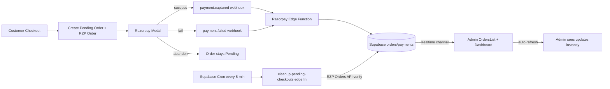
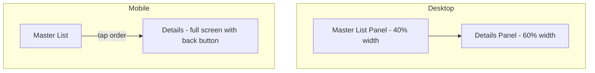

# Plan: Admin Orders UI Redesign + Razorpay Webhooks & Pending-Checkout Detection

## Overview

This plan covers three workstreams for the Swadyum admin panel and payment backend:

1. **Redesign the admin Orders UI** (list + details) for faster comprehension and management.
2. **Automated pending-checkout detection** — mark orders as `failed` when a user opens Razorpay checkout but never completes payment (30-min threshold, cron-driven).
3. **Real-time Razorpay webhook handling** — extend the existing edge function to process `payment.failed` / `payment.authorized` and reflect changes instantly on the dashboard via Supabase Realtime.

---

## Architecture Diagram



---

## Current State Analysis

### Orders UI — [`admin/src/pages/OrdersList.jsx`](admin/src/pages/OrdersList.jsx:1)
- Flat 8-column table; filters hidden behind a toggle; no status summary cards; no bulk actions; no inline status editing; pagination only prev/next.
- Already subscribes to Supabase Realtime on the `orders` table (line 79) — good foundation.

### Order Details — [`admin/src/pages/OrderDetails.jsx`](admin/src/pages/OrderDetails.jsx:1)
- 3-column layout with products, payment, timeline, customer, address, status update, tracking, invoice. Functional but visually heavy; status update is a separate sidebar card requiring scroll.

### Razorpay flow — [`src/CheckoutPage.jsx`](src/CheckoutPage.jsx:138)
- `createPendingOrder()` inserts an order with `payment_status: 'Pending'`, `order_status: 'Pending'`, and `razorpay_order_id` BEFORE opening the modal.
- On success: frontend updates order to `Paid` + edge function `verify_payment` runs.
- **Gap**: If the user closes the modal or abandons the tab, the order stays `Pending` forever. No `payment.failed` handling, no abandonment sweep.

### Razorpay edge function — [`supabase/functions/razorpay/index.ts`](supabase/functions/razorpay/index.ts:279)
- Handles `payment.captured` and `order.paid` (line 286).
- **Does NOT handle** `payment.failed` or `payment.authorized` (pending) events.
- Has `verifyWebhookSignature()` already implemented (line 69).

### Dashboard — [`admin/src/pages/Dashboard.jsx`](admin/src/pages/Dashboard.jsx:43)
- Fetches metrics once on load/profile change; **no Realtime subscription** — metrics go stale until manual refresh.

### Schema — [`supabase_schema.sql`](supabase_schema.sql:101) / [`create_orders_tables.sql`](create_orders_tables.sql:1)
- `orders` table has `status`, `payment_id`, `razorpay_order_id` (added by checkout), `payment_status`, `order_status`, `created_at`, `updated_at`.
- **Missing**: `failed_at`, `checkout_expires_at`, `failure_reason` columns for robust pending-checkout tracking.
- `payments` table is referenced by the edge function but not defined in the schema files read — needs verification/creation.

---

## Workstream 1 — Redesigned Orders UI (Master-Detail Split View)

**Goal**: A single unified Orders page with a master list on the left and a details panel on the right, eliminating navigation between separate list and details pages. Faster comprehension, efficient management, real-time awareness.

### 1A. New unified Orders page — `OrdersManager.jsx`

**File**: `admin/src/pages/OrdersManager.jsx` (new — replaces both `OrdersList.jsx` and `OrderDetails.jsx` as the primary orders view).

#### Layout — responsive master-detail split



**Desktop (lg+)**: Two-pane split — left master list (~40%), right details panel (~60%). Selecting an order in the list instantly loads its details on the right without a route change.

**Mobile/tablet**: Single pane. List view by default; tapping an order navigates to a full-screen details view (with a back button). Implemented via a `selectedOrderId` state + a CSS/responsive toggle (no separate route needed, but a URL param `?order=ID` is synced for shareable links and back-button support).

#### Top bar (full width, above the split)
1. **Status Summary Cards** (horizontal row) — clickable filter shortcuts:
   - New / Pending (yellow) • Confirmed (blue) • Shipped (purple) • Delivered (green) • Failed/Abandoned (red) • Refunded (gray)
   - Each card shows count + revenue; clicking filters the master list by that status.
   - Counts update in real-time via the Realtime subscription.

2. **Unified Search + Filter Bar** (always visible):
   - Search input (order ID, customer, email, phone, coupon).
   - Quick status chips (All / Pending / Confirmed / Shipped / Delivered / Failed) — horizontal scroll on mobile.
   - Collapsible "Advanced" section for date range + payment status.
   - Live indicator (pulsing dot) showing Realtime connection status.

#### Master List Panel (left)
- Compact, scannable list of orders (not a wide table — a vertical list of order cards/rows optimized for the narrower pane):
  - Each row: order ID (mono), customer name + avatar initial, total, payment status dot, order status pill, relative time.
  - Selected row highlighted; click selects it and loads details on the right.
  - Checkbox column for **bulk selection** + a slim bulk action bar appears when ≥1 selected (Mark Confirmed, Mark Shipped, Export Selected, Cancel Selected).
  - **Inline status dropdown** per row (compact pill `<select>`) — change status without opening details.
  - Infinite scroll OR "Load more" button (preferred over pagination for a split-view list) — loads 25 at a time, appends to the list.
  - Sticky search/filter at top of the panel; list scrolls independently.
  - Empty state with illustration + CTA to adjust filters.

#### Details Panel (right)
- Renders the full order details for the selected order (reuses the OrderDetails content, restructured):
  - **Sticky status header** — order ID, payment status pill, order status pill, primary "Update Status" dropdown always visible at top.
  - **Payment failure banner** — if `payment_status === 'Failed'`, red banner with failure reason + "Retry Payment" note.
  - **Products table** (compact), **Payment Details** card (Razorpay IDs as copy-to-clipboard chips), **Timeline** (with payment events: `Payment Initiated`, `Payment Captured`, `Payment Failed`).
  - **Customer + Shipping Address** (stacked cards).
  - **Status & Tracking** (combined card with courier/aWB inputs).
  - **Invoice** card.
  - **Realtime subscription** filtered to the selected order id so details update live when webhooks fire.
  - When no order is selected (desktop): a placeholder state ("Select an order to view details").

#### Routing
- Replace the two routes (`/orders` → OrdersList, `/orders/:id` → OrderDetails) with a single route `/orders` → `OrdersManager`.
- Sync selected order to URL query param `?order=<id>` so links are shareable and the browser back button works on mobile.
- Keep `/orders/:id` as a redirect to `/orders?order=<id>` for backward compatibility with existing links/emails.

#### Files
- **Create**: `admin/src/pages/OrdersManager.jsx` — the unified split-view component.
- **Modify**: [`admin/src/App.jsx`](admin/src/App.jsx:48) — update routes.
- **Deprecate**: `admin/src/pages/OrdersList.jsx` and `admin/src/pages/OrderDetails.jsx` (kept for reference, no longer routed).
- **Extract**: Shared order-fetching + status-color helpers into `admin/src/lib/orderUtils.js` to avoid duplication between the list and details portions.

---

## Workstream 2 — Pending-Checkout Detection (Cron + Edge Function)

### 2A. Schema migration

Add columns to `orders` for robust tracking:

```sql
-- migrations/add_checkout_tracking_columns.sql
ALTER TABLE public.orders
  ADD COLUMN IF NOT EXISTS checkout_expires_at timestamptz,
  ADD COLUMN IF NOT EXISTS failed_at timestamptz,
  ADD COLUMN IF NOT EXISTS failure_reason text;

-- Backfill: pending orders with a razorpay_order_id get a 30-min expiry from created_at
UPDATE public.orders
SET checkout_expires_at = created_at + interval '30 minutes'
WHERE payment_status = 'Pending'
  AND razorpay_order_id IS NOT NULL
  AND checkout_expires_at IS NULL;
```

### 2B. CheckoutPage.jsx — set `checkout_expires_at` on order creation

In [`src/CheckoutPage.jsx`](src/CheckoutPage.jsx:146) `createPendingOrder()`, add to `orderData`:

```js
checkout_expires_at: new Date(Date.now() + 30 * 60 * 1000).toISOString(),
```

### 2C. New edge function: `cleanup-pending-checkouts`

**File**: `supabase/functions/cleanup-pending-checkouts/index.ts`

Logic:
1. Query `orders` where `payment_status = 'Pending'` AND `razorpay_order_id IS NOT NULL` AND `checkout_expires_at < now()`.
2. For each, call Razorpay Orders API (`GET https://api.razorpay.com/v1/orders/{id}`) with Basic auth to fetch the true status.
3. Map Razorpay status:
   - `paid` → leave (webhook should have handled it; if not, trigger `processPaymentCapture`).
   - `attempted` / `failed` → mark order `payment_status='Failed'`, `order_status='Cancelled'`, `failed_at=now()`, `failure_reason` from Razorpay.
   - `created` (never attempted, expired) → mark `payment_status='Failed'`, `order_status='Cancelled'`, `failure_reason='Checkout abandoned — no payment attempt'`.
4. Insert a `order_timeline` entry: `event='Payment Failed'`, `note` with reason, `created_by='system'`.
5. Restore inventory if order had been pre-allocated (it isn't in current flow, so skip).

### 2D. Supabase scheduled cron

Register the edge function as a Supabase cron job (via `pg_cron` extension, configured in Supabase dashboard or SQL):

```sql
-- Run every 5 minutes
SELECT cron.schedule(
  'cleanup-pending-checkouts',
  '*/5 * * * *',
  $$ SELECT net.http_post(
    url := 'https://<project>.functions.supabase.co/cleanup-pending-checkouts',
    headers := '{"Authorization":"Bearer <SERVICE_ROLE_KEY>"}'::jsonb,
    body := '{}'::jsonb
  ) $$
);
```

(Alternatively use the Supabase Dashboard > Cron UI to schedule the function invocation.)

---

## Workstream 3 — Razorpay Webhook Handling (Real-time)

### 3A. Extend `supabase/functions/razorpay/index.ts`

Add handling for two new events in the webhook branch (after line 309):

#### `payment.failed`
```ts
if (body.event === 'payment.failed') {
  const payment = body.payload.payment.entity;
  const razorpayOrderId = payment.order_id;
  const reason = payment.error_description || payment.error_code || 'Payment failed';

  // Find order by razorpay_order_id
  const { data: order } = await supabaseAdmin
    .from('orders').select('id')
    .eq('razorpay_order_id', razorpayOrderId).single();

  if (order) {
    await supabaseAdmin.from('orders').update({
      payment_status: 'Failed',
      order_status: 'Cancelled',
      failed_at: new Date().toISOString(),
      failure_reason: reason,
      updated_at: new Date().toISOString()
    }).eq('id', order.id);

    await supabaseAdmin.from('order_timeline').insert([{
      order_id: order.id,
      event: 'Payment Failed',
      note: `Razorpay: ${reason} (Payment ID: ${payment.id})`,
      created_by: 'system'
    }]);

    // Record failed payment attempt
    await supabaseAdmin.from('payments').insert([{
      order_id: order.id,
      razorpay_payment_id: payment.id,
      razorpay_order_id: razorpayOrderId,
      payment_method: payment.method || 'Online / Razorpay',
      amount: payment.amount / 100,
      currency: 'INR',
      status: 'Failed',
      failure_reason: reason,
      payment_date: new Date().toISOString()
    }]);
  }
}
```

#### `payment.authorized` (pending/authorized but not captured)
- Update `payment_status` to `Authorized` (intermediate) and add a timeline entry `Payment Authorized — awaiting capture`. Do NOT mark as `Paid` until `payment.captured`.

### 3B. Realtime dashboard updates

#### OrdersManager.jsx (master list)
- Realtime subscription on the `orders` table (carried over from the old OrdersList). Extend the callback to also re-fetch summary card counts (new state `statusCounts`).
- Add a `statusCounts` fetch (single grouped query) that runs alongside `fetchOrders`.
- When a `postgres_changes` event arrives for the currently-selected order, the details panel re-fetches that order automatically.

#### Dashboard.jsx
- Add a Supabase Realtime subscription on the `orders` table that triggers `fetchDashboardData()` on any change — so revenue, pending counts, etc. update live when webhooks write to the DB.

```js
useEffect(() => {
  const channel = supabase
    .channel('dashboard-orders-realtime')
    .on('postgres_changes', { event: '*', schema: 'public', table: 'orders' }, () => fetchDashboardData())
    .subscribe();
  return () => supabase.removeChannel(channel);
}, [fetchDashboardData]);
```

#### OrdersManager.jsx (details panel)
- Subscribe to `postgres_changes` filtered to the selected order id (`filter: id=eq.{selectedOrderId}`) so the details panel updates live when a webhook fires for that order.

---

## Implementation Todo List (for Code mode)

- [ ] **Schema**: Create `migrations/add_checkout_tracking_columns.sql` (failed_at, checkout_expires_at, failure_reason) + backfill.
- [ ] **CheckoutPage.jsx**: Set `checkout_expires_at` in `createPendingOrder()`.
- [ ] **Edge function — razorpay/index.ts**: Add `payment.failed` and `payment.authorized` handlers; add failed-payment record insertion.
- [ ] **New edge function — cleanup-pending-checkouts/index.ts**: Query expired pending orders, verify via Razorpay Orders API, mark failed, add timeline entries.
- [ ] **Supabase cron**: Schedule `cleanup-pending-checkouts` every 5 minutes (SQL or dashboard config).
- [ ] **OrdersManager.jsx**: Create unified master-detail split view — summary cards, always-visible filter bar, master list with bulk selection + inline status dropdown + load-more, details panel with sticky status header + copy chips + failure banner + single-order Realtime subscription.
- [ ] **orderUtils.js**: Extract shared order helpers (status colors, customer info, CSV export).
- [ ] **App.jsx**: Update routes — `/orders` → OrdersManager; `/orders/:id` redirects to `/orders?order=<id>`.
- [ ] **Dashboard.jsx**: Add Realtime subscription on `orders` table for live metric refresh.
- [ ] **Verify `payments` table** exists in Supabase (referenced by edge function); create if missing with `migrations/create_payments_table.sql`.
- [ ] **Test**: Trigger a failed Razorpay payment in test mode; confirm order auto-marks failed via webhook; confirm admin dashboard + orders split view update live without refresh.

---

## Files to Create / Modify

| File | Action |
|------|--------|
| `migrations/add_checkout_tracking_columns.sql` | Create |
| `migrations/create_payments_table.sql` | Create (if payments table missing) |
| `src/CheckoutPage.jsx` | Modify — add `checkout_expires_at` |
| `supabase/functions/razorpay/index.ts` | Modify — add `payment.failed` + `payment.authorized` handlers |
| `supabase/functions/cleanup-pending-checkouts/index.ts` | Create — cron-driven abandonment sweep |
| `admin/src/pages/OrdersManager.jsx` | Create — unified master-detail split view |
| `admin/src/lib/orderUtils.js` | Create — shared order helpers |
| `admin/src/App.jsx` | Modify — update routes |
| `admin/src/pages/Dashboard.jsx` | Modify — add Realtime subscription |
| `admin/src/pages/OrdersList.jsx` | Deprecate (no longer routed) |
| `admin/src/pages/OrderDetails.jsx` | Deprecate (no longer routed) |

---

## Security Considerations

- Webhook signature verification already exists ([`razorpay/index.ts`](supabase/functions/razorpay/index.ts:69)) — reuse for new events. Fail closed if `RAZORPAY_WEBHOOK_SECRET` missing.
- `cleanup-pending-checkouts` edge function must be protected (service-role key only, not publicly invokable) since it performs admin-level DB writes.
- Razorpay Orders API calls in the cleanup function use server-side `RAZORPAY_KEY_ID` + `RAZORPAY_KEY_SECRET` — never exposed to client.
- All DB writes in edge functions use the Supabase service-role client (bypasses RLS) — consistent with existing `processPaymentCapture`.

---

## Notes / Assumptions

- The `payments` table is referenced by [`razorpay/index.ts`](supabase/functions/razorpay/index.ts:91) but not in the schema files read. Implementation will verify and create it if absent (columns: `id, order_id, razorpay_payment_id, razorpay_order_id, payment_method, amount, currency, status, failure_reason, payment_date, created_at`).
- The 30-minute abandonment threshold is configurable via the `checkout_expires_at` value set at checkout time; the cron simply compares `checkout_expires_at < now()`.
- Realtime updates rely on Supabase Realtime being enabled for the `orders` table (it appears enabled given the existing subscription in OrdersList).
