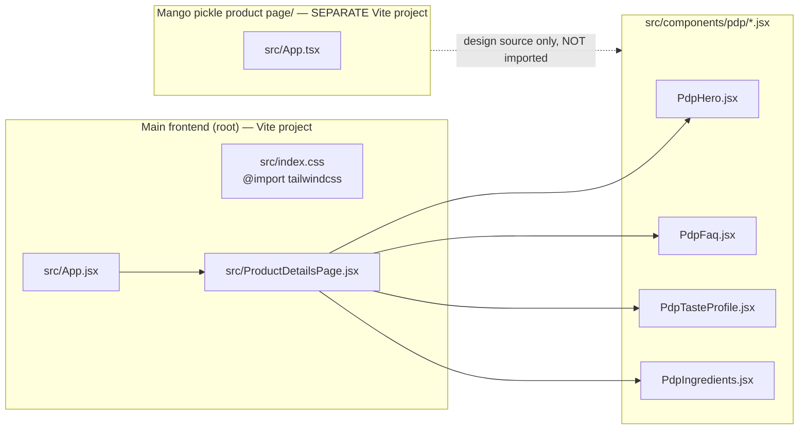

# PDP Section Centering Issue — Diagnosis

## Summary
The product detail page (PDP) sections imported from the `Mango pickle product page`
folder are **not centering** on the live site. This is **NOT** a "JS vs Tailwind"
incompatibility — the main frontend already runs Tailwind CSS v4. The real cause is
a **Tailwind content-scanning gap**: the utility classes that do the centering are
not being generated for the PDP components.

## How the two codebases relate



- `Mango pickle product page/` is a **standalone Figma-Make Vite app** (its own
  `package.json`, `vite.config.ts`, `src/index.css`). It is the **design source**.
- The actual production components live in `src/components/pdp/*.jsx` and are
  imported by `src/ProductDetailsPage.jsx` → `src/App.jsx`.
- The main frontend (`package.json`) **does** include `tailwindcss` + `@tailwindcss/vite`,
  and `src/index.css` has `@import "tailwindcss";`. So Tailwind IS active.

## Root cause

The PDP components center their content with Tailwind utilities, e.g.:

| File | Centering class |
|------|-----------------|
| [`PdpHero.jsx`](src/components/pdp/PdpHero.jsx:89) | `max-w-6xl mx-auto` |
| [`PdpFaq.jsx`](src/components/pdp/PdpFaq.jsx:18) | `mx-auto max-w-[680px]` |
| [`PdpIngredients.jsx`](src/components/pdp/PdpIngredients.jsx:32) | `mx-auto max-w-6xl` |
| [`PdpTasteProfile.jsx`](src/components/pdp/PdpTasteProfile.jsx:62) | `mx-auto max-w-6xl` |

These classes only exist if Tailwind's scanner sees them in a source file.
Two things can break that here:

1. **Tailwind v4 automatic source detection** scans files reachable from the CSS
   entry via the Vite module graph. The PDP `.jsx` files are imported through
   `ProductDetailsPage.jsx` → `App.jsx` → `main.jsx`, so they *should* be scanned.
   However, if the dev server / build was started **before** these files were added,
   or the Tailwind cache is stale, the utilities are not emitted and `mx-auto` /
   `max-w-*` silently do nothing → content sits left-aligned, full-bleed.

2. **No `@source` directive** exists in `src/index.css`. Tailwind v4 only auto-detects
   files in the **same "base" directory** as the CSS by default. Because the PDP
   components live under `src/components/pdp/` (a nested path) and were ported from a
   *different* Vite project, there is no explicit guarantee they are in the scan roots.
   If automatic detection misses them, none of their utility classes are generated.

Either way the symptom is identical: **the centering utilities are absent from the
compiled stylesheet**, so every `mx-auto max-w-*` wrapper collapses to default
block behavior (full width, left aligned). That is exactly the "not middle aligned"
look in the screenshot.

## Why it looks like a "JS vs Tailwind" problem
The rest of the site (`HeroSection`, `Footer`, `ShopPage`, etc.) uses **plain CSS
classes** (`.hero-content { max-width: 680px; }`, `.pdp-section-container { max-width:
var(--max-width); margin: 0 auto; }`) defined in `*.css` files. Those always work
because they are hand-written, not generated. Only the ported PDP sections rely on
generated Tailwind utilities — so only they break, which makes it feel like a
"mode mismatch". It is really a **Tailwind generation/scanning** issue, not a
JS-vs-Tailwind conflict.

## How to confirm (no code edits)
1. Open DevTools on a broken PDP section, inspect the `mx-auto max-w-6xl` div.
2. In the Styles pane, check whether `.mx-auto { margin-left:auto; margin-right:auto }`
   and `.max-w-6xl { max-width: 72rem }` appear. If they are **missing**, the
   diagnosis is confirmed — Tailwind is not emitting those utilities.
3. Alternatively, search the compiled CSS served by Vite for `max-w-6xl`. Absent
   = not generated.

## Fix options (for the implementation phase — NOT applied now)
- **Preferred:** add an explicit source root to `src/index.css` so Tailwind always
  scans the PDP folder:
  ```css
  @import "tailwindcss";
  @source "../src/components/pdp";
  ```
- **Alternative:** restart the Vite dev server / clear the Vite + Tailwind cache so
  the module-graph scan re-runs and picks up the PDP files.
- **Alternative (most robust, matches rest of site):** replace the Tailwind
  centering utilities in the PDP components with the existing hand-written
  `.pdp-section-container` class from `ProductDetailsPage.css`
  (`max-width: var(--max-width); margin: 0 auto;`), so centering no longer depends
  on Tailwind generation at all.

## Conclusion
The misalignment is caused by **missing Tailwind utility classes** for the PDP
sections (centering relies on `mx-auto` + `max-w-*` that are not being generated),
**not** by a fundamental JS-vs-Tailwind incompatibility. The main frontend already
has Tailwind v4 wired up; the gap is purely in source scanning / cache for the
ported `src/components/pdp/*.jsx` files.
