# PDP Section Spacing & Alignment Standardization Plan

## Critical Discovery: Tailwind CSS Is NOT Available

**Tailwind CSS is not a dependency in the root [`package.json`](package.json)** and the `@import "tailwindcss"` directive was recently removed from [`index.css`](src/index.css). This means **all Tailwind utility classes in the 4 JSX-based sections are dead code** — they produce no CSS. These sections currently render with only base CSS reset styles, which explains the spacing/alignment issues.

The fix is therefore a **migration from Tailwind utilities to proper CSS with design tokens** for these 4 files, plus standardization of the 5 CSS-based sections.

## Problem Summary

The 9 PDP sections imported into [`ProductDetailsPage.jsx`](src/ProductDetailsPage.jsx) fall into two categories:

**A. JSX with dead Tailwind classes (4 files — need CSS files created):**
- [`PdpHero.jsx`](src/components/pdp/PdpHero.jsx) — `px-6`, `max-w-6xl`, `gap-10`, `flex`, `rounded-2xl`, etc.
- [`PdpIngredients.jsx`](src/components/pdp/PdpIngredients.jsx) — `px-6`, `max-w-6xl`, `grid`, `rounded-2xl`, etc.
- [`PdpTasteProfile.jsx`](src/components/pdp/PdpTasteProfile.jsx) — `px-4`, `max-w-6xl`, `rounded-[2rem]`, etc.
- [`PdpFaq.jsx`](src/components/pdp/PdpFaq.jsx) — `pt-16`, `max-w-[680px]`, `flex`, etc.

**B. CSS-based sections (5 files — need standardization tweaks):**
- [`PdpComboSection.css`](src/components/pdp/PdpComboSection.css) — uses tokens but wrong max-width + mobile padding
- [`PdpProcessTimeline.css`](src/components/pdp/PdpProcessTimeline.css) — uses tokens but wrong max-width
- [`PdpUgc.css`](src/components/pdp/PdpUgc.css) — uses tokens, minor fallback cleanup
- [`PdpRelated.css`](src/components/pdp/PdpRelated.css) — uses tokens but wrong max-width + mobile padding
- [`PdpStickyBar.css`](src/components/pdp/PdpStickyBar.css) — uses tokens correctly, no changes needed

This creates:

1. **Dead Tailwind classes** — 4 sections have no actual CSS driving their layout (critical)
2. **Inconsistent horizontal padding** — sections drift between `px-4`, `px-6`, `var(--space-4)`, `var(--space-6)` at different breakpoints
3. **Inconsistent vertical rhythm** — sections use `py-12`, `py-16`, `pt-16 md:pt-24`, or `var(--pdp-section-y)` with no unified value
4. **Inconsistent max-widths** — `1152px` (max-w-6xl), `1160px`, `1180px`, `1280px` across sections
5. **Mixed hardcoded colors** — some sections use Tailwind arbitrary values like `bg-[#fbfaf6]` instead of design tokens like `var(--color-bg-warm)`

## Design System Reference

From [`index.css`](src/index.css:117-130) and [`spacing.css`](Swadyum Design System/tokens/spacing.css):

| Token | Value | Usage |
|-------|-------|-------|
| `--space-4` | 1rem (16px) | Card inner padding, small gaps |
| `--space-6` | 1.5rem (24px) | Section horizontal padding (standard) |
| `--space-16` | 4rem (64px) | Section vertical padding (mobile) |
| `--space-24` | 6rem (96px) | Section vertical padding (desktop) |
| `--pdp-section-y` | `clamp(2.75rem, 6vw, 5rem)` | PDP-specific vertical rhythm |
| `--max-width` | 1280px | Unified container max-width |

**Decision: Use `--pdp-section-y` for vertical padding** (it's already defined in [`ProductDetailsPage.css`](src/ProductDetailsPage.css:13) and used by CSS-based sections). This gives `44px` on mobile, scaling up to `80px` on desktop — a refined editorial rhythm.

**Decision: Use `--max-width: 1280px`** as the unified container width for all sections.

**Decision: Use `--space-6` (24px)** as the standard horizontal padding for all sections at all breakpoints (matching the design system's `.section-padding`).

---

## Section-by-Section Fix Plan

### 1. PdpHero.jsx — HIGH PRIORITY (most complex, most issues)

**Current state:**
- Wrapper: `px-6 md:px-12 pb-16 max-w-6xl mx-auto` (Tailwind)
- No top padding (correct — hero is first section)
- Bottom padding: `pb-16` = 4rem (should be `--pdp-section-y`)

**Changes needed:**
- Replace `px-6 md:px-12` → `px-[--space-6]` (consistent 24px at all breakpoints)
- Replace `pb-16` → `pb-[--pdp-section-y]` (use the CSS variable)
- Replace `max-w-6xl` → `max-w-[--max-width]` (1280px instead of 1152px)
- Replace hardcoded colors like `bg-[#f5f0e8]`, `text-[#1a1a1a]`, `border-[#2d5a27]` with design tokens where applicable (secondary — color standardization can be a follow-up)

**File:** [`src/components/pdp/PdpHero.jsx`](src/components/pdp/PdpHero.jsx:56)

---

### 2. PdpComboSection.jsx + PdpComboSection.css — HIGH PRIORITY

**Current state:**
- CSS uses `var(--pdp-section-y, 6rem)` for vertical padding ✓
- Mobile horizontal: `var(--space-4)` (16px) — too narrow
- Desktop horizontal: `var(--space-6)` (24px) ✓
- Container max-width: `1180px` — not unified

**Changes needed:**
- Change mobile horizontal padding from `var(--space-4)` → `var(--space-6)` at line 2 of CSS
- Change container max-width from `1180px` → `1280px` at line 18 of CSS
- Remove the `6rem` fallback from `var(--pdp-section-y, 6rem)` since `--pdp-section-y` is always defined — just use `var(--pdp-section-y)`

**Files:**
- [`src/components/pdp/PdpComboSection.css`](src/components/pdp/PdpComboSection.css:2)
- [`src/components/pdp/PdpComboSection.css`](src/components/pdp/PdpComboSection.css:18)

---

### 3. PdpFaq.jsx — HIGH PRIORITY (most hardcoded values)

**Current state:**
- Section wrapper: `bg-[#fbfaf6] pt-16 md:pt-24` — hardcoded
- FAQ container: `max-w-[680px] px-6` — narrower width is intentional for readability
- Trust badge grid: full-bleed `border-y` with no container — jarring width jump
- Bottom CTA: `max-w-[680px] px-6 py-10 md:py-16` — hardcoded

**Changes needed:**
- Replace `bg-[#fbfaf6]` → `bg-[var(--color-bg-warm)]` (or use `var(--color-bg-warm)` directly)
- Replace `pt-16 md:pt-24` → `pt-[--pdp-section-y]` (single token, responsive via clamp)
- Add `pb-[--pdp-section-y]` to the section wrapper for consistent bottom spacing
- Wrap the trust badge grid in a container that matches the FAQ width (680px) OR make the FAQ content full-width to match — **Recommendation: keep FAQ at 680px, wrap trust badges in same 680px container for smooth transition**
- Replace hardcoded `py-10 md:py-16` on bottom CTA → `py-[--space-10] md:py-[--space-16]`
- Replace hardcoded colors (`text-[#173518]`, `bg-[#234622]`, etc.) with design tokens

**File:** [`src/components/pdp/PdpFaq.jsx`](src/components/pdp/PdpFaq.jsx:17)

---

### 4. PdpTasteProfile.jsx — MEDIUM PRIORITY

**Current state:**
- Section wrapper: `px-4 py-12 md:px-12 md:py-20` — hardcoded
- Inner card: `max-w-6xl` (1152px), `rounded-[2rem]` (32px, not in design system)

**Changes needed:**
- Replace `px-4 py-12 md:px-12 md:py-20` → `px-[--space-6] py-[--pdp-section-y]`
- Replace `max-w-6xl` → `max-w-[--max-width]` (1280px)
- Replace `rounded-[2rem]` → `rounded-[--radius-xl]` (24px) — or keep 2rem if intentional design choice, but document the deviation
- Replace hardcoded colors (`bg-[#234622]`, `text-[#c7dca8]`, etc.) with design tokens

**File:** [`src/components/pdp/PdpTasteProfile.jsx`](src/components/pdp/PdpTasteProfile.jsx:18-19)

---

### 5. PdpIngredients.jsx — MEDIUM PRIORITY

**Current state:**
- Section wrapper: `px-6 py-16 md:px-12 md:py-24` — hardcoded
- Container: `max-w-6xl` (1152px)

**Changes needed:**
- Replace `px-6 py-16 md:px-12 md:py-24` → `px-[--space-6] py-[--pdp-section-y]`
- Replace `max-w-6xl` → `max-w-[--max-width]` (1280px)
- Replace hardcoded colors (`bg-[#f7f1e6]`, `text-[#8b3a1a]`, etc.) with design tokens

**File:** [`src/components/pdp/PdpIngredients.jsx`](src/components/pdp/PdpIngredients.jsx:31)

---

### 6. PdpProcessTimeline.css — LOW PRIORITY (already close)

**Current state:**
- Uses `var(--pdp-section-y, 6rem) var(--space-6)` ✓
- Container max-width: `1160px` — close but not unified

**Changes needed:**
- Change `.timeline-container` max-width from `1160px` → `1280px`
- Remove `6rem` fallback → just `var(--pdp-section-y)`

**File:** [`src/components/pdp/PdpProcessTimeline.css`](src/components/pdp/PdpProcessTimeline.css:13)

---

### 7. PdpUgc.css — LOW PRIORITY (already close)

**Current state:**
- Uses `var(--pdp-section-y, 6rem) var(--space-6)` ✓
- Inner card max-width: `620px` — intentional narrow for centered CTA

**Changes needed:**
- Remove `6rem` fallback → just `var(--pdp-section-y)`
- No max-width change needed (620px is intentional for this centered invite card)

**File:** [`src/components/pdp/PdpUgc.css`](src/components/pdp/PdpUgc.css:3)

---

### 8. PdpRelated.css — MEDIUM PRIORITY

**Current state:**
- Uses `var(--pdp-section-y, 6rem)` for vertical ✓
- Mobile horizontal: `var(--space-4)` (16px) — too narrow
- Desktop horizontal: `var(--space-6)` (24px) ✓
- Container max-width: `1180px`

**Changes needed:**
- Change mobile horizontal padding from `var(--space-4)` → `var(--space-6)`
- Change container max-width from `1180px` → `1280px`
- Remove `6rem` fallback → just `var(--pdp-section-y)`

**Files:**
- [`src/components/pdp/PdpRelated.css`](src/components/pdp/PdpRelated.css:2)
- [`src/components/pdp/PdpRelated.css`](src/components/pdp/PdpRelated.css:8)

---

### 9. PdpStickyBar.css — VERIFICATION ONLY

**Current state:**
- Fixed position bottom bar — structurally fine
- Uses `var(--space-*)` tokens consistently ✓

**Verification needed:**
- Check that [`index.css`](src/index.css:434) `body { padding-bottom: 70px }` at mobile doesn't conflict with the sticky bar height
- The sticky bar padding is `var(--space-2) var(--space-4)` — at mobile the bar content is ~56px tall, so 70px body padding is adequate

**No changes needed.**

---

### 10. ProductDetailsPage.css — TOKEN REVIEW

**Current state:**
- Defines `--pdp-section-y: clamp(2.75rem, 6vw, 5rem)` ✓
- The `.pdp-wrapper` has `padding-top: var(--header-height)` ✓

**Changes needed:**
- None — the token definition is correct and will be inherited by all sections

---

## Execution Order (Revised for Tailwind→CSS Migration)

```
Phase 1: Create CSS files for Tailwind-based sections (new files)
1. Create PdpHero.css        ← Most complex, sets the standard for all others
2. Create PdpIngredients.css ← Complex grid layout
3. Create PdpTasteProfile.css ← Inner card with taste meters
4. Create PdpFaq.css         ← Accordion + trust badges + CTA

Phase 2: Update JSX files to use CSS classes
5. Update PdpHero.jsx        ← Replace all Tailwind classes with CSS class names
6. Update PdpIngredients.jsx ← Replace all Tailwind classes with CSS class names
7. Update PdpTasteProfile.jsx ← Replace all Tailwind classes with CSS class names
8. Update PdpFaq.jsx         ← Replace all Tailwind classes, fix trust-badge width

Phase 3: Standardize existing CSS-based sections
9. Fix PdpComboSection.css   ← mobile padding + max-width + fallback
10. Fix PdpRelated.css        ← mobile padding + max-width + fallback
11. Fix PdpProcessTimeline.css ← max-width + fallback
12. Fix PdpUgc.css            ← fallback removal only

Phase 4: Verification
13. Verify PdpStickyBar.css   ← no changes needed
14. Final review              ← Check all 9 sections together
```

## Unified Standards (Post-Fix)

| Property | Value | Token |
|----------|-------|-------|
| Vertical section padding | `clamp(2.75rem, 6vw, 5rem)` | `var(--pdp-section-y)` |
| Horizontal section padding | 24px all breakpoints | `var(--space-6)` |
| Container max-width | 1280px | `var(--max-width)` |
| Narrow content max-width | 680px (FAQ), 620px (UGC) | Custom, documented |
| Border radius (cards) | 24px | `var(--radius-xl)` |
| Section background | Varies by section | `var(--color-bg-warm)`, `var(--color-surface)`, etc. |

## CSS Class Naming Convention

All new CSS classes will follow the existing PDP pattern: `pdp-{component}-{element}`. Examples:
- `pdp-hero` — section wrapper
- `pdp-hero-container` — inner max-width container
- `pdp-hero-gallery` — left column gallery
- `pdp-ingredients-grid` — Bento grid layout
- `pdp-faq-item` — individual FAQ accordion row

This matches existing conventions in [`PdpComboSection.css`](src/components/pdp/PdpComboSection.css), [`PdpRelated.css`](src/components/pdp/PdpRelated.css), etc.

## Mermaid: Section Spacing Architecture

```mermaid
graph TD
    A["PdpWrapper: padding-top: var(--header-height)"] --> B
    A --> C
    A --> D
    A --> E
    A --> F
    A --> G
    A --> H
    A --> I
    A --> J
    
    subgraph "UNIFIED STANDARDS"
        V["Vertical: var(--pdp-section-y)"]
        H2["Horizontal: var(--space-6)"]
        M["Max-width: var(--max-width) = 1280px"]
    end
    
    B["PdpHero: px-space-6, pb-pdp-section-y, max-w-1280"]
    C["PdpStickyBar: fixed bottom, no changes"]
    D["PdpIngredients: px-space-6, py-pdp-section-y, max-w-1280"]
    E["PdpTasteProfile: px-space-6, py-pdp-section-y, max-w-1280"]
    F["PdpProcessTimeline: px-space-6, py-pdp-section-y, max-w-1280"]
    G["PdpUgc: px-space-6, py-pdp-section-y, inner 620px"]
    H["PdpFaq: px-space-6, py-pdp-section-y, inner 680px"]
    I["PdpComboSection: px-space-6, py-pdp-section-y, max-w-1280"]
    J["PdpRelated: px-space-6, py-pdp-section-y, max-w-1280"]
    
    V -.-> B
    V -.-> D
    V -.-> E
    V -.-> F
    V -.-> G
    V -.-> H
    V -.-> I
    V -.-> J
    
    H2 -.-> B
    H2 -.-> D
    H2 -.-> E
    H2 -.-> F
    H2 -.-> G
    H2 -.-> H
    H2 -.-> I
    H2 -.-> J
    
    M -.-> B
    M -.-> D
    M -.-> E
    M -.-> F
    M -.-> I
    M -.-> J
```



## Key Migration Principles

1. **Preserve visual design exactly** — the CSS must reproduce what the Tailwind classes intended
2. **Use design tokens everywhere** — `var(--space-*)`, `var(--color-*)`, `var(--radius-*)`, `var(--font-*)`
3. **Keep inline styles only for dynamic values** — e.g., `style={{ borderColor: color }}` for taste profile meters
4. **Follow existing CSS file patterns** — match the structure of [`PdpComboSection.css`](src/components/pdp/PdpComboSection.css) and [`PdpRelated.css`](src/components/pdp/PdpRelated.css)
5. **Add responsive breakpoints** — use `@media (min-width: 768px)` and `@media (min-width: 1024px)` to replace Tailwind's `md:` and `lg:` prefixes
6. **Remove all Tailwind class strings from JSX** — replace `className="px-6 md:px-12 pb-16 max-w-6xl mx-auto"` with `className="pdp-hero"`

## Notes

- **Color standardization** is included in this pass since we're writing CSS from scratch — there's no reason to hardcode colors in new CSS files
- The `PdpTabs.jsx` file referenced in open tabs does not exist on disk — it may have been removed or renamed
- The `@source` directives previously in [`index.css`](src/index.css) that referenced PDP components have also been removed
- All new CSS files should be imported in the respective JSX files: `import './PdpHero.css';`