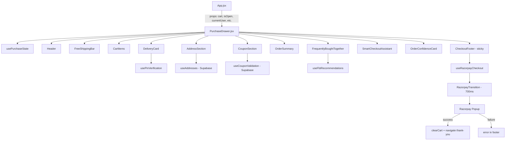

# Purchase Drawer Redesign — Architectural Plan

**Based on:** [`instructions.md`](../instructions.md)  
**Current component to transform:** [`src/components/cart/CartDrawer.jsx`](../src/components/cart/CartDrawer.jsx)  
**Date:** 2026-07-11

---

## 1. Core Concept Shift

The current `CartDrawer` is a two-step drawer (cart → checkout form). The redesign transforms it into a **Purchase Drawer** — a single, unified, scrollable checkout experience. The customer never leaves this experience. No visible stepper. No separate checkout page. Everything flows in one continuous scroll.

### What Changes in App.jsx

Currently `App.jsx` renders `<CartDrawer>` and navigates to a separate `CheckoutPage`. After the redesign:
- The `CheckoutPage` route becomes unused (or redirects to opening the Purchase Drawer)
- The Purchase Drawer handles the entire purchase flow internally
- `App.jsx` props to the drawer remain largely the same: `isOpen`, `onClose`, `cart`, `updateCartQty`, `removeFromCart`, `addToCart`, `onNavigate`, `currentUser`, `clearCart`, `onOpenLogin`

---

## 2. Purchase Drawer Structure (per instructions.md §2)

The drawer scrolls vertically through these sections in order:

```
┌─────────────────────────────────┐
│  HEADER: "Your Cart (N)" + ← Continue Shopping + ✕ Close  │
├─────────────────────────────────┤
│  FREE SHIPPING PROGRESS BAR     │  ← always visible when cart has items
├─────────────────────────────────┤
│  CART ITEMS (compact ~110px)    │  ← redesigned product cards
├─────────────────────────────────┤
│  DELIVERY CARD                  │  ← PIN entry → animated verification
├─────────────────────────────────┤
│  ADDRESS SECTION                │  ← collapsed → tap to expand sheet
│    └─ Saved Addresses (one-tap) │
├─────────────────────────────────┤
│  COUPON SECTION                 │  ← collapsed → animated expansion
├─────────────────────────────────┤
│  ORDER SUMMARY                  │  ← collapsed by default
├─────────────────────────────────┤
│  FREQUENTLY BOUGHT TOGETHER     │  ← horizontal snapping carousel
├─────────────────────────────────┤
│  ORDER CONFIDENCE CARD          │  ← trust reinforcement
├─────────────────────────────────┤
│  SMART CHECKOUT ASSISTANT       │  ← proactive suggestions
├─────────────────────────────────┤
│  STICKY FOOTER (always visible) │
│  ├─ Price + Delivery Estimate   │
│  ├─ Trust Badges (monochrome)   │
│  └─ "Secure Checkout →" button  │
└─────────────────────────────────┘
```

---

## 3. Component Architecture

Per [`instructions.md:690-693`](../instructions.md:690), the drawer should be a **state-driven purchase system** composed of independent modules. Each module has its own state and loading behavior.

### 3.1 Module Breakdown

| Module | File | Responsibility | States |
|--------|------|---------------|--------|
| **PurchaseDrawer** (container) | `src/components/cart/PurchaseDrawer.jsx` | Orchestrates all modules, manages scroll, sticky footer, Razorpay transition | idle, processing, error |
| **CartItems** | `src/components/cart/modules/CartItems.jsx` | Compact product cards with quantity controls, remove, price display | normal, empty |
| **FreeShippingBar** | `src/components/cart/modules/FreeShippingBar.jsx` | Progress bar with confetti burst at 100% | in-progress, achieved |
| **DeliveryCard** | `src/components/cart/modules/DeliveryCard.jsx` | PIN entry → spinner → deliverable/not-deliverable → ETA | idle, checking, deliverable, not-deliverable |
| **AddressSection** | `src/components/cart/modules/AddressSection.jsx` | Collapsed summary → expand to address sheet with saved addresses | collapsed, expanded, loading-addresses |
| **CouponSection** | `src/components/cart/modules/CouponSection.jsx` | Collapsed toggle → animated expansion → code input → green glow on success | collapsed, expanded, applying, applied, error |
| **OrderSummary** | `src/components/cart/modules/OrderSummary.jsx` | Collapsed mini-summary of items + price breakdown | collapsed, expanded |
| **FrequentlyBoughtTogether** | `src/components/cart/modules/FrequentlyBoughtTogether.jsx` | Horizontal snapping carousel with [+] tap to add | loading, loaded |
| **OrderConfidenceCard** | `src/components/cart/modules/OrderConfidenceCard.jsx` | Trust reinforcement above checkout button | static |
| **SmartCheckoutAssistant** | `src/components/cart/modules/SmartCheckoutAssistant.jsx` | Proactive suggestions (e.g., "₹142 away from free shipping") | idle, showing-suggestion |
| **CheckoutFooter** | `src/components/cart/modules/CheckoutFooter.jsx` | Sticky footer: price, delivery estimate, trust badges, checkout button with hover/press/ripple/loading states | idle, hover, pressed, loading, preparing-razorpay |
| **RazorpayTransition** | `src/components/cart/modules/RazorpayTransition.jsx` | 700ms "Preparing Secure Payment..." animation overlay before Razorpay popup | idle, preparing |

### 3.2 Shared/Utility Modules

| Module | File | Purpose |
|--------|------|---------|
| **usePurchaseState** | `src/components/cart/hooks/usePurchaseState.js` | Central state machine for the purchase flow |
| **usePinVerification** | `src/components/cart/hooks/usePinVerification.js` | PIN code validation logic (checking → spinner → result) |
| **useAddresses** | `src/components/cart/hooks/useAddresses.js` | Fetch/manage saved addresses from Supabase |
| **useCouponValidation** | `src/components/cart/hooks/useCouponValidation.js` | Coupon code validation against Supabase |
| **useFbtRecommendations** | `src/components/cart/hooks/useFbtRecommendations.js` | Fetch FBT products (could be static or Supabase-driven) |
| **useRazorpayCheckout** | `src/components/cart/hooks/useRazorpayCheckout.js` | Razorpay script loading, order creation, payment verification |
| **purchaseDrawer.css** | `src/components/cart/PurchaseDrawer.css` | All drawer styles (modular CSS with BEM-like naming) |

### 3.3 Directory Structure

```
src/components/cart/
├── PurchaseDrawer.jsx          ← replaces CartDrawer.jsx
├── PurchaseDrawer.css          ← replaces CartDrawer.css
├── modules/
│   ├── CartItems.jsx
│   ├── CartItems.css
│   ├── FreeShippingBar.jsx
│   ├── FreeShippingBar.css
│   ├── DeliveryCard.jsx
│   ├── DeliveryCard.css
│   ├── AddressSection.jsx
│   ├── AddressSection.css
│   ├── CouponSection.jsx
│   ├── CouponSection.css
│   ├── OrderSummary.jsx
│   ├── OrderSummary.css
│   ├── FrequentlyBoughtTogether.jsx
│   ├── FrequentlyBoughtTogether.css
│   ├── OrderConfidenceCard.jsx
│   ├── OrderConfidenceCard.css
│   ├── SmartCheckoutAssistant.jsx
│   ├── SmartCheckoutAssistant.css
│   ├── CheckoutFooter.jsx
│   ├── CheckoutFooter.css
│   ├── RazorpayTransition.jsx
│   └── RazorpayTransition.css
└── hooks/
    ├── usePurchaseState.js
    ├── usePinVerification.js
    ├── useAddresses.js
    ├── useCouponValidation.js
    ├── useFbtRecommendations.js
    └── useRazorpayCheckout.js
```

---

## 4. Data Flow & State Architecture

### 4.1 Central State Machine (`usePurchaseState`)

```
States:
  IDLE           → drawer open, user browsing cart
  CHECKING_PIN   → PIN being verified
  PIN_VALID      → delivery confirmed, address section expands
  PIN_INVALID    → show "not deliverable" message
  SELECTING_ADDRESS → address sheet expanded
  ADDRESS_SELECTED → address chosen
  APPLYING_COUPON  → coupon being validated
  COUPON_APPLIED   → coupon applied, green glow
  PROCESSING       → "Preparing Secure Payment..." (700ms)
  RAZORPAY_OPEN    → Razorpay popup active
  PAYMENT_SUCCESS  → redirect to thank-you
  PAYMENT_FAILED   → show error, allow retry
  ERROR           → generic error state
```

### 4.2 Props Interface (PurchaseDrawer)

Same props as current CartDrawer to minimize changes in App.jsx:

```jsx
<PurchaseDrawer
  isOpen={isOpen}
  onClose={onClose}
  cart={cart}
  updateCartQty={updateCartQty}
  removeFromCart={removeFromCart}
  addToCart={addToCart}
  onNavigate={onNavigate}
  currentUser={currentUser}
  clearCart={clearCart}
  onOpenLogin={onOpenLogin}
/>
```

### 4.3 Internal State (within PurchaseDrawer)

```js
// Purchase flow state
const [purchaseState, setPurchaseState] = useState('idle');
const [selectedAddress, setSelectedAddress] = useState(null);
const [appliedCoupon, setAppliedCoupon] = useState(null);
const [pinCode, setPinCode] = useState('');
const [deliveryEta, setDeliveryEta] = useState(null);
const [isAddressExpanded, setIsAddressExpanded] = useState(false);
const [isCouponExpanded, setIsCouponExpanded] = useState(false);
const [isSummaryExpanded, setIsSummaryExpanded] = useState(false);
const [processingMessage, setProcessingMessage] = useState('');
```

### 4.4 Computed Values

```js
const subtotal = cart.reduce((sum, item) => sum + (item.price * item.quantity), 0);
const totalItems = cart.reduce((sum, item) => sum + item.quantity, 0);
const shipping = subtotal >= 799 ? 0 : (subtotal > 0 ? 50 : 0);
const discount = calculateDiscount(appliedCoupon, subtotal);
const total = Math.max(0, subtotal - discount + shipping);
const amountAway = Math.max(0, 799 - subtotal);
const progressPercent = Math.min(100, (subtotal / 799) * 100);
```

---

## 5. Section-by-Section Implementation Details

### 5.1 Header
- **Keep existing** header structure: ← Continue Shopping | "Your Cart (N)" | ✕ Close
- No stepper. No "Back to Cart" / "Checkout" toggle.
- The header stays fixed at top while content scrolls beneath.

### 5.2 Free Shipping Progress Bar
- **Keep existing** progress bar logic but add **confetti burst** micro-interaction when progress hits 100% (per [`instructions.md:469-481`](../instructions.md:469))
- Confetti: small green/gold particles burst from the 100% mark using framer-motion `animate` with `staggerChildren`
- Text changes: "You're ₹X away from FREE Shipping" → "✓ FREE Shipping Unlocked!" with confetti

### 5.3 Cart Items (Product Card Redesign)
Per [`instructions.md:103-146`](../instructions.md:103):

**Current card:** ~90px image, vertical stack, delivery ETA inline, remove button with 🗑 emoji  
**New card (~110px height, 8pt grid):**

```
┌────────────────────────────────────────────┐
│ [IMG 72×72]  Product Name                  │
│   rounded    Weight • Subscription          │
│              ★★★★☆ (rating)                │
│              ₹249  ₹350  Save ₹101         │
│              [−] [Qty:1] [+]    [Remove]   │
└────────────────────────────────────────────┘
```

Key changes:
- Image: 72×72px (down from 90×90), `border-radius: var(--radius-md)` (10px)
- Remove 🗑 emoji from remove button → use text "Remove" with subtle styling
- Remove inline delivery ETA from each card (moved to Delivery section)
- Add star rating display
- Quantity controls: number scales to 105% on change (per [`instructions.md:463-468`](../instructions.md:463))
- Staggered entrance animation (keep existing `staggerVariants`)

### 5.4 Delivery Card
Per [`instructions.md:173-213`](../instructions.md:173):

**New section** — replaces the inline delivery ETA on each product card.

States:
1. **Idle:** Shows "Enter PIN code to check delivery" with a 6-digit input
2. **Checking:** Input locks, shows "Checking..." with animated spinner
3. **Deliverable:** Green checkmark, "✓ We deliver to your area", "Estimated delivery: Tuesday, Jul 15"
4. **Not deliverable:** "Sorry, we don't deliver to this PIN yet"

Implementation:
- `usePinVerification` hook handles the async flow
- PIN validation can be: (a) mock/demo with 500ms delay checking against a hardcoded list, or (b) actual Shiprocket PIN serviceability API
- The animation sequence: typing → lock input → spinner 800ms → result reveal with framer-motion `AnimatePresence`

### 5.5 Address Section
Per [`instructions.md:214-277`](../instructions.md:214):

**Collapsed state:** Shows a summary pill: "Shipping to: [selected address summary]" or "Add delivery address ↓"

**Expanded state (address sheet):**
- Slides up from bottom of the section (not a separate screen)
- If user has saved addresses (from Supabase `addresses` table): show as selectable cards with one-tap selection
- "Add New Address" button at bottom
- Selected address gets a border highlight + checkmark

**Saved Address card (per [`instructions.md:260-277`](../instructions.md:260)):**
- Shows: label (Home/Office), name, condensed address, phone
- One-tap selection with card flip animation (3D transform on tap)
- Default address pre-selected

**New Address form:** Inline form within the expanded sheet (not a separate page):
- Full Name, Phone, Email
- House/Flat No., Street, Area
- City, State, PIN (auto-filled from Delivery PIN)
- "Save & Select" button

### 5.6 Coupon Section
Per [`instructions.md:278-313`](../instructions.md:278):

**Collapsed:** "Have a coupon? ▼" toggle button

**Expanded (animated):**
- Code input + Apply button
- On success: green glow animation around the section, checkmark draw SVG animation
- Applied coupon shows: "🏷️ WELCOME10 applied — You saved ₹X"
- Remove button to clear

**Green glow animation:** Use framer-motion to animate a `box-shadow` from transparent to `0 0 20px rgba(10, 90, 50, 0.3)` and back.

### 5.7 Order Summary
Per [`instructions.md:345-373`](../instructions.md:345):

**Collapsed by default:** "Order Summary (N items) ▼"

**Expanded:**
- Mini item list (image + name + qty × price)
- Subtotal, Shipping, Discount, Total rows
- Same data as sticky footer but in expandable detail

### 5.8 Frequently Bought Together
Per [`instructions.md:314-344`](../instructions.md:314):

**Current:** Static hardcoded `UPSELL_PRODUCTS` array, horizontal scroll  
**New:** Horizontal **snapping** carousel (CSS `scroll-snap-type: x mandatory`)

- Each card: image, name, weight, price, MRP with strikethrough, savings badge, [+] button
- Tapping [+] adds to cart and **auto-updates subtotal** in footer
- Cards snap into position as user scrolls
- Data source: can remain static array or be fetched from Supabase (future enhancement)

### 5.9 Order Confidence Card
Per [`instructions.md:664-689`](../instructions.md:664):

Placed **above** the checkout button in the sticky footer area (or just before footer in scroll).

Content:
- "✓ 100% Natural Ingredients"
- "✓ No Preservatives"
- "✓ FSSAI Certified"
- "✓ Secure Razorpay Checkout"
- "✓ Free Shipping above ₹799"

Styled as minimal monochrome icons with subtle green tint — not colorful badges.

### 5.10 Smart Checkout Assistant
Per [`instructions.md:625-663`](../instructions.md:625):

Proactive, context-aware suggestions that appear as a subtle card:

Examples:
- "You're ₹142 away from free shipping. Add 250g Mango Pickle to save ₹50."
- "Buy 2 jars of Garlic Pickle and save 10% with code GARLICDUO"

Implementation:
- Rule-based engine: checks `amountAway`, cart contents, available coupons
- Shows only one suggestion at a time
- Appears between FBT and Order Confidence Card
- Has a dismiss button (×)

### 5.11 Sticky Footer (Checkout Footer)
Per [`instructions.md:147-172`](../instructions.md:147):

**Always visible** at bottom of drawer, even while scrolling.

Layout:
```
┌─────────────────────────────────────┐
│  Subtotal: ₹X                       │
│  Delivery: FREE / ₹50               │
│  Discount: -₹X (if coupon applied)  │
│  ═══════════════════════════════    │
│  Total: ₹XXX    [Secure Checkout →] │
│  🍃 Natural  🔒 Secure  ✓ FSSAI    │
└─────────────────────────────────────┘
```

**Checkout Button States (per [`instructions.md:394-411`](../instructions.md:394)):**
1. **Idle:** "Secure Checkout →" with total
2. **Hover:** lifts 2px, shadow deepens
3. **Press:** scales to 0.98
4. **Loading (Preparing):** "Preparing Secure Payment..." with spinner, 700ms
5. **Razorpay open:** button shows "Processing..."

**Button text:** "Secure Checkout →" (not "Proceed to Checkout" or "Pay Now")

### 5.12 Razorpay Transition
Per [`instructions.md:412-432`](../instructions.md:412):

**700ms animated transition** before Razorpay popup opens:

1. User taps "Secure Checkout →"
2. Drawer content fades slightly (overlay with 0.3 opacity)
3. Centered card appears: "Preparing Secure Payment..." with animated dots
4. 700ms duration
5. Razorpay popup opens normally
6. On payment success: clear cart, navigate to thank-you
7. On payment failure: transition card dismisses, error shown in footer

**Implementation:** Use the existing Razorpay integration code from CartDrawer (lines 257-325), wrapped with the 700ms transition animation. The `useRazorpayCheckout` hook extracts this logic.

---

## 6. Mobile Interaction (Apple Maps-like Drag)
Per [`instructions.md:433-460`](../instructions.md:433):

On mobile (< 768px), the drawer becomes a **bottom sheet** with drag handles:

**States:**
- **Closed:** off-screen
- **Open (Half):** occupies bottom 50% of screen — shows cart items + footer
- **Open (Full):** occupies 100% of screen — full scrollable purchase flow

**Implementation:**
- Use framer-motion `drag="y"` with `dragConstraints` and `dragElastic`
- Drag handle (visual pill indicator) at top of drawer on mobile
- `onDragEnd` checks velocity and position to snap to nearest state
- Desktop: keeps current side-drawer behavior (480px width, slides from right)

**CSS:**
```css
@media (max-width: 768px) {
  .purchase-drawer {
    width: 100vw;
    height: 100dvh; /* full screen when fully open */
    border-radius: 20px 20px 0 0; /* top corners rounded */
    top: auto;
    bottom: 0;
    right: auto;
    left: 0;
  }
}
```

---

## 7. Micro-Interactions Checklist
Per [`instructions.md:461-581`](../instructions.md:461):

| # | Interaction | Where | Implementation |
|---|-------------|-------|----------------|
| 1 | Quantity number scales to 105% on change | CartItems qty control | CSS `transform: scale(1.05)` on `span` via framer-motion `animate` on qty change |
| 2 | Free shipping confetti burst at 100% | FreeShippingBar | framer-motion particles with `staggerChildren`, green/gold colors |
| 3 | Coupon green glow + checkmark draw | CouponSection | `box-shadow` animation + SVG checkmark `stroke-dashoffset` animation |
| 4 | PIN verification spinner → checkmark | DeliveryCard | Spinner 800ms → morph to checkmark SVG |
| 5 | Address card flip on selection | AddressSection | CSS `transform: rotateY(180deg)` with `backface-visibility` |
| 6 | Checkout button hover/press/ripple/loading | CheckoutFooter | CSS `:hover` lift, `:active` scale, ripple effect on click, spinner for loading |
| 7 | Razorpay 700ms transition | RazorpayTransition | Overlay + centered card with animated dots |
| 8 | Staggered item entrance | CartItems | Keep existing `staggerVariants` from current CartDrawer |
| 9 | Collapse/expand animations | Coupon, Address, Summary | framer-motion `AnimatePresence` with height animation |

---

## 8. Visual Hierarchy (per instructions.md §8)

Priority order determines **visual weight** (size, color saturation, spacing):

1. **Checkout Button** — largest, most saturated (primary green), always visible
2. **Product** — product name bold, image prominent
3. **Price** — large, bold, high contrast
4. **Delivery** — clear ETA, green checkmark
5. **Quantity** — easy tap targets, clear +/- buttons
6. **Trust** — minimal but present, monochrome icons
7. **Coupon** — collapsed by default, subtle
8. **Summary** — collapsed by default, lowest visual weight

---

## 9. Dynamic Drawer Height
Per [`instructions.md:81-102`](../instructions.md:81):

- **Desktop:** Fixed 480-520px width, full viewport height, slides from right
- **Mobile:** 100% width, height varies by drag state (Half: 50vh, Full: 100dvh)
- Content area uses `overflow-y: auto` with `flex: 1`
- Sticky footer uses `position: sticky; bottom: 0;`

---

## 10. What Gets Removed/Replaced

| Current | Replaced By |
|---------|-------------|
| `CartDrawer.jsx` (673 lines) | `PurchaseDrawer.jsx` (container) + 11 module files |
| `CartDrawer.css` (811 lines) | `PurchaseDrawer.css` + per-module CSS files |
| Two-step cart→checkout flow | Single scrollable flow |
| "Proceed to Checkout" → separate form step | Everything inline in the scroll |
| Inline delivery ETA on each product card | Dedicated DeliveryCard with PIN verification |
| Manual address form in checkout step | AddressSection with saved addresses + one-tap |
| Hardcoded WELCOME10 coupon | CouponSection with Supabase validation |
| Static upsell list | Snapping FBT carousel |
| "Pay Now" button | "Secure Checkout →" with 700ms Razorpay transition |
| 🗑 emoji remove button | Text "Remove" button |
| `CheckoutPage.jsx` (separate page) | No longer needed for drawer flow (may still exist for direct URL access) |

---

## 11. What Stays the Same

| Element | Notes |
|---------|-------|
| Props interface from App.jsx | Same prop names and types |
| Razorpay integration logic | Extracted to `useRazorpayCheckout` hook, same API calls |
| Supabase client | Same `supabaseClient.js` import |
| Order creation (`createPendingOrder`) | Same logic, moved to hook |
| Cart state management | Still managed in App.jsx, passed as props |
| Free shipping threshold (₹799) | Same constant |
| Design tokens | All from `index.css` (`--color-*`, `--space-*`, `--motion-*`, `--radius-*`, `--shadow-*`) |
| framer-motion | Same library for all animations |
| `staggerVariants` | Same staggered entrance for cart items |
| Overlay + drawer pattern | Same AnimatePresence structure |
| Body scroll lock | Same `useEffect` for `document.body.style.overflow` |
| History pushState for back-button | Same pattern |

---

## 12. Implementation Order

### Step 1: Create hooks (no visual changes)
- `usePurchaseState.js` — state machine
- `usePinVerification.js` — PIN checking logic
- `useAddresses.js` — Supabase address fetch
- `useCouponValidation.js` — Supabase coupon validation
- `useFbtRecommendations.js` — FBT data
- `useRazorpayCheckout.js` — extracted Razorpay logic

### Step 2: Create module components (bottom-up)
- `FreeShippingBar.jsx` + `.css` (simplest, mostly existing code)
- `CartItems.jsx` + `.css` (redesigned product cards)
- `DeliveryCard.jsx` + `.css` (new, PIN verification)
- `CouponSection.jsx` + `.css` (refactored from existing)
- `OrderSummary.jsx` + `.css` (refactored from existing mini-summary)
- `AddressSection.jsx` + `.css` (new, saved addresses)
- `FrequentlyBoughtTogether.jsx` + `.css` (refactored upsells)
- `OrderConfidenceCard.jsx` + `.css` (new)
- `SmartCheckoutAssistant.jsx` + `.css` (new)
- `CheckoutFooter.jsx` + `.css` (refactored sticky footer)
- `RazorpayTransition.jsx` + `.css` (new)

### Step 3: Create PurchaseDrawer container
- Compose all modules in scroll order
- Wire up state machine
- Implement mobile drag interaction
- Implement sticky footer

### Step 4: Update App.jsx
- Replace `import CartDrawer` with `import PurchaseDrawer`
- Replace `<CartDrawer .../>` with `<PurchaseDrawer .../>`
- Props unchanged

### Step 5: Cleanup (optional)
- Remove or archive old `CartDrawer.jsx` and `CartDrawer.css`
- `CheckoutPage.jsx` can remain for direct URL access but is no longer the primary flow

---

## 13. Architecture Diagram



---

## 14. Key Design Decisions & Rationale

1. **Modular files over single large component:** Per instructions.md §"One architectural recommendation" — each module is independently testable and maintainable.

2. **Hooks for business logic:** Separates UI from data fetching and state management. Same hooks could be reused if a full-page checkout is ever needed.

3. **Keep existing props interface:** Minimizes changes to App.jsx, reducing regression risk.

4. **CSS per module:** Avoids a single massive CSS file. Each module's CSS is scoped to its concerns. Shared variables come from `index.css` design tokens.

5. **Mobile drag as enhancement:** Desktop behavior stays the same (side drawer). Mobile gets the Apple Maps-like bottom sheet. Both use the same internal component structure.

6. **Razorpay logic extraction:** The current Razorpay code is duplicated between CartDrawer and CheckoutPage. Extracting to a hook eliminates duplication.

7. **No new dependencies:** Everything uses existing libraries (React, framer-motion, Supabase client). No additional npm packages needed.