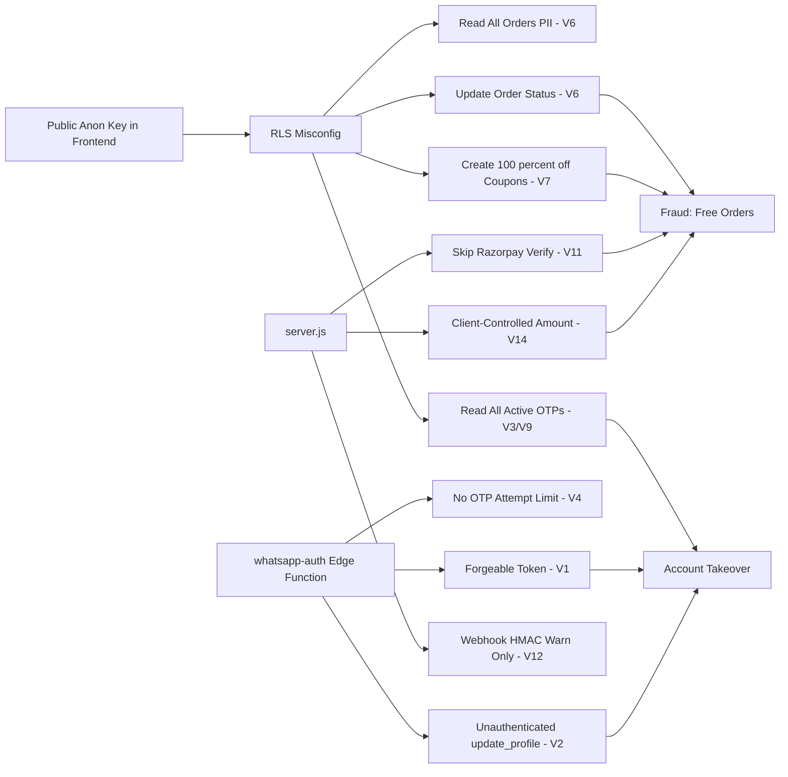

# Swadyum Website — Security Vulnerability Audit

> **REMEDIATION STATUS (2026-07-09):** All 21 findings have been addressed.
> See the "Remediation Summary" section at the bottom of this document.

Audit date: 2026-07-09
Scope: `server.js`, `src/` frontend API/auth helpers, `supabase/functions/*` edge functions, SQL/RLS policies, `admin/` client.

Severity legend: 🔴 Critical · 🟠 High · 🟡 Medium · 🟢 Low

---

## 1. Authentication & Authorization

### 🔴 V1 — WhatsApp OTP auth issues a fake, forgeable session token
**File:** [`supabase/functions/whatsapp-auth/index.ts`](supabase/functions/whatsapp-auth/index.ts:203)

After OTP verification the function returns:
```ts
token: "wa_custom_token_" + profile.id
```
This string is a **static, predictable concatenation** — not a signed JWT. The frontend stores the returned `profile` in `localStorage` ([`WhatsAppLoginModal.jsx`](src/components/auth/WhatsAppLoginModal.jsx:70)) and treats the user as logged in. There is **no server-side session**, no signature, and no expiry. Anyone who knows a profile UUID can construct a valid "token". This effectively bypasses authentication for any flow that trusts this token.

**Fix:** Issue a real Supabase JWT (e.g. via `supabase.auth.admin.generateLink` / custom-claims JWT) or a signed session token (HMAC + expiry) verified on every protected request.

### 🔴 V2 — `update_profile` action has no authentication
**File:** [`supabase/functions/whatsapp-auth/index.ts`](supabase/functions/whatsapp-auth/index.ts:213)

The `update_profile` branch accepts an arbitrary `id` from the request body and upserts into `profiles` using the **service role key** (bypasses RLS). There is **no verification that the caller owns `id`**. Any anonymous caller can overwrite any user's `name`, `email`, and `phone` by POSTing `{ action: 'update_profile', id: <victim-uuid>, ... }`.

This is invoked from [`src/mockDb.js`](src/mockDb.js:200) with no auth header.

**Fix:** Require a valid user JWT, verify `id === jwt.sub`, and reject mismatches. Do not expose `update_profile` over the public edge function endpoint without auth.

### 🟠 V3 — OTP stored in plaintext and globally readable via RLS
**Files:** [`create_whatsapp_auth_tables.sql`](create_whatsapp_auth_tables.sql:17), [`supabase/functions/whatsapp-auth/index.ts`](supabase/functions/whatsapp-auth/index.ts:55)

- OTPs are stored in `whatsapp_otps.otp` as **plaintext**.
- The RLS policy `Enable service role access for whatsapp_otps` uses `USING (true) WITH CHECK (true)` with **no role restriction** — meaning the `anon` and `authenticated` keys (which are public in the frontend bundle) can `SELECT * FROM whatsapp_otps` and read every active OTP.

Anyone with the public anon key (committed in [`src/supabaseClient.js`](src/supabaseClient.js:4)) can query the OTP table and bypass login entirely.

**Fix:** Hash the OTP (bcrypt/argon2 or at minimum HMAC). Restrict the RLS policy to `TO service_role` only:
```sql
CREATE POLICY "service_role only" ON public.whatsapp_otps
  FOR ALL TO service_role USING (true) WITH CHECK (true);
```

### 🟠 V4 — OTP rate limiting is per-phone only, no IP/global throttle
**File:** [`supabase/functions/whatsapp-auth/index.ts`](supabase/functions/whatsapp-auth/index.ts:31)

Rate limiting only enforces a 60-second cooldown per phone number. An attacker can:
- Enumerate phone numbers (one OTP each, no cap).
- Brute-force the 6-digit OTP: there is **no attempt counter**. The verify branch deletes the OTP on success but does not lock out after N failed attempts, so `10^6` guesses are possible within the 10-minute window (limited only by network round-trips).

**Fix:** Add a failed-attempt counter with lockout (e.g. 5 attempts), add IP-based rate limiting, and use a TOTP-style hash-then-compare to avoid timing attacks.

### 🟡 V5 — `Math.random()` used for OTP generation
**File:** [`supabase/functions/whatsapp-auth/index.ts`](supabase/functions/whatsapp-auth/index.ts:51)

`Math.random()` is **not cryptographically secure**. Use `crypto.getRandomValues()` (available in Deno) for OTP generation.

---

## 2. Row Level Security (RLS) — Critical Misconfigurations

### 🔴 V6 — Orders and order_items are world-readable and world-writable
**File:** [`fix_orders_rls.sql`](fix_orders_rls.sql:23)

```sql
CREATE POLICY "Anyone can view orders" ON public.orders FOR SELECT USING (true);
CREATE POLICY "Anyone can update orders" ON public.orders FOR UPDATE USING (true);
CREATE POLICY "Anyone can view order items" ON public.order_items FOR SELECT USING (true);
CREATE POLICY "Anyone can update order items" ON public.order_items FOR UPDATE USING (true);
```

- **Any anonymous user can read every order** in the system (customer PII: name, address, phone, email, payment IDs).
- **Any anonymous user can UPDATE any order** — e.g. flip `status` to `'Paid'` without paying, change shipping addresses, alter totals.

This is a direct data-breach and fraud vector.

**Fix:** Restrict `SELECT` to `auth.uid() = user_id` (plus admin allow-list). Never allow unauthenticated `UPDATE`. Use the service role in edge functions for system-driven updates.

### 🔴 V7 — Coupons table opened to full public access
**File:** [`relax_rls.sql`](relax_rls.sql:6)

```sql
CREATE POLICY "Enable all access for all users"
ON public.coupons FOR ALL USING (true) WITH CHECK (true);
```

This **overrides** the safer policy in [`create_coupons_table.sql`](create_coupons_table.sql:18) and grants `INSERT`/`UPDATE`/`DELETE` to everyone. Any anonymous user can:
- Create arbitrary coupons (e.g. 100% off).
- Modify `discount_value`, `valid_until`, `usage_count`.
- Delete coupons.

**Fix:** Drop this policy. Restore `SELECT` for active coupons only, and restrict write policies to admin emails (as in [`fix_coupons_rls.sql`](fix_coupons_rls.sql:1)) — but note V8 below.

### 🟠 V8 — Admin authorization is based on a hardcoded email allow-list
**File:** [`fix_orders_rls.sql`](fix_orders_rls.sql:31)

```sql
USING (auth.email() IN (SELECT email FROM public.admin_users));
```

- The `admin_users` table is populated with fixed emails (`stark@gmail.com`, `manager@gmail.com`, `warehouse@gmail.com`) in the same SQL file. If a user registers with one of these emails via standard Supabase auth, they instantly gain admin privileges (email enumeration / account-takeover via signup).
- There is no verification that these emails belong to trusted operators.

**Fix:** Use Supabase `auth.uid()`-based admin roles with manually-verified accounts, or an `is_admin` flag set only via the service role. Disable public signup for admin emails or require email confirmation + manual promotion.

### 🟠 V9 — `whatsapp_otps` RLS policy grants access to all roles
**File:** [`create_whatsapp_auth_tables.sql`](create_whatsapp_auth_tables.sql:17)

See V3 — the policy has no `TO` clause, so it defaults to `public` (anon + authenticated). Combined with the public anon key in the frontend, the OTP table is fully exposed.

---

## 3. Secrets & Configuration

### 🔴 V10 — Supabase anon key hardcoded and committed in two clients
**Files:** [`src/supabaseClient.js`](src/supabaseClient.js:4), [`admin/src/lib/supabase.js`](admin/src/lib/supabase.js:4)

The anon key is embedded as a literal. While anon keys are *intended* to be public, they are only safe **when RLS is correctly configured**. Given V6/V7/V9, this key currently grants read/write access to all orders, coupons, and OTPs. The admin client uses the **same anon key** — there is no separate admin auth, so the admin panel has no elevated privileges beyond what the public key provides.

**Fix:** Fix RLS first (V6/V7/V9). Then move keys to env vars (`import.meta.env.VITE_SUPABASE_URL` etc.) and ensure the admin panel authenticates with a real admin session, not the public anon key.

### 🟠 V11 — Razorpay signature verification silently skipped in "mock mode"
**File:** [`server.js`](server.js:297)

```js
if (keySecret && !keySecret.includes('YOUR_KEY')) {
  // verify signature
} else {
  // Mock mode: skip verification
}
```

If `RAZORPAY_KEY_SECRET` is unset or contains the placeholder, the server **skips payment verification entirely** and proceeds to fulfill the order. A misconfigured production deployment (missing env var) would silently accept any `razorpay_payment_id` — including forged ones — and create a Shiprocket shipment. The only guard is `razorpay_payment_id.startsWith('mock_')`, which the attacker controls.

**Fix:** Fail closed — if the secret is missing in production, reject the request with 500. Never skip verification based on a client-controllable prefix.

### 🟠 V12 — Shiprocket webhook HMAC mismatch only logs a warning
**File:** [`server.js`](server.js:757)

```js
if (calculatedSignature !== providedSignature) {
  console.warn(`⚠️ Shiprocket Order Webhook HMAC mismatch! ...`);
  // During early testing, we might just warn, but usually we would return 401
}
```

The webhook **continues processing** and inserts/updates orders even when the signature is invalid. An attacker can POST arbitrary order data to `/api/webhooks/shiprocket/order` and create fake orders / overwrite statuses. (Note: the edge-function variant [`fastrr-order-webhook/index.ts`](supabase/functions/fastrr-order-webhook/index.ts:47) correctly returns 401 — the `server.js` version does not.)

**Fix:** Return `401` on mismatch, exactly as the edge function does.

### 🟡 V13 — `.env` loading does not quote/escape values
**File:** [`server.js`](server.js:29)

The custom `.env` parser splits on `=` and takes everything after the first `=`. Values containing `#` mid-value, spaces, or quotes are not handled per dotenv spec. This can silently truncate or corrupt secrets (e.g. a key ending in `#comment`). Use the `dotenv` package (already a dependency per [`package.json`](package.json:25)).

---

## 4. Input Validation & Injection

### 🟠 V14 — No server-side price/amount validation on order fulfillment
**File:** [`server.js`](server.js:276)

`/api/fulfill-order` accepts `orderData.items`, `orderData.total`, `shippingDetails` directly from the client and forwards them to Shiprocket and (via webhook) to the orders table. There is **no re-computation of totals from authoritative product data**. A client can submit `amount: 1` to Razorpay, pay ₹0.01, and still have the full order fulfilled.

The Razorpay `create-razorpay-order` endpoint ([`server.js`](server.js:225)) also trusts the client-supplied `amount` with no cart validation.

**Fix:** Server should fetch the cart from Supabase (or a server-side cart store), recompute the total from authoritative variant prices, and use *that* amount for Razorpay order creation and fulfillment.

### 🟡 V15 — Unbounded pagination on catalog endpoints
**File:** [`server.js`](server.js:430)

`limit = parseInt(req.query.limit) || 50` has no upper bound. A request like `?limit=1000000` will attempt to load the entire table into memory. Cap `limit` to a sane maximum (e.g. 100).

### 🟡 V16 — `redirect_url` in Fastrr checkout is client-controlled
**File:** [`server.js`](server.js:385), [`supabase/functions/fastrr-checkout/index.ts`](supabase/functions/fastrr-checkout/index.ts:82)

The client supplies `redirect_url`, which is forwarded to Shiprocket. If Shiprocket redirects users to this URL post-checkout, this is an **open-redirect** vector usable for phishing. Validate `redirect_url` against an allow-list of trusted domains.

### 🟢 V17 — Error messages leak internal details
**Files:** [`server.js`](server.js:267), [`supabase/functions/whatsapp-auth/index.ts`](supabase/functions/whatsapp-auth/index.ts:249)

Raw `err.message` (including Supabase/Razorpay internal errors) is returned to the client. This can leak schema details, key prefixes, or stack info. Return generic messages to clients; log details server-side.

---

## 5. CORS & Transport

### 🟡 V18 — Edge functions use `Access-Control-Allow-Origin: '*'`
**Files:** all `supabase/functions/*/index.ts`

Every edge function returns `Access-Control-Allow-Origin: *`. Combined with the service-role-backed operations and the lack of origin checks, any website can invoke these functions cross-origin. Restrict to your production domains (and localhost in dev).

### 🟢 V19 — `server.js` CORS allows only localhost origins
**File:** [`server.js`](server.js:59)

`origin: ['http://localhost:5173', 'http://localhost:4173']` is fine for dev but **will block production frontends**. Ensure the deployed backend updates this allow-list to the real domain (and that the real domain uses HTTPS).

---

## 6. Other

### 🟡 V20 — `delete-account` edge function uses anon key, not service role
**File:** [`supabase/functions/delete-account/index.ts`](supabase/functions/delete-account/index.ts:15)

The function creates a client with `SUPABASE_ANON_KEY` and the caller's `Authorization` header, then inserts into `account_deletion_requests`. This is correct for RLS-scoped inserts, but the table's RLS is not shown in the audited files — verify that only the owning user can insert a row with their own `user_id`. Otherwise a user could create deletion requests for others.

### 🟢 V21 — `localStorage` used for user session
**File:** [`src/components/auth/WhatsAppLoginModal.jsx`](src/components/auth/WhatsAppLoginModal.jsx:70)

Storing the user profile / "token" in `localStorage` exposes it to any XSS script. Given the lack of CSP observed, prefer `httpOnly` cookies for session tokens, or at minimum a CSP header.

---

## Priority Remediation Order

1. **V6 / V7** — Fix orders & coupons RLS immediately (active data breach + fraud).
2. **V1 / V2 / V3 / V9** — Replace fake token with real auth; lock down `update_profile` and OTP table.
3. **V11 / V12** — Make signature verification fail-closed.
4. **V14** — Server-authoritative cart pricing.
5. **V8 / V10** — Admin authorization model + secret management.
6. Remaining items (rate limiting, CORS, validation hardening).

---

## Mermaid — Vulnerability Impact Map


